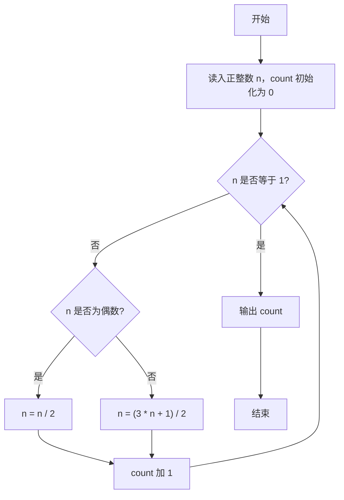
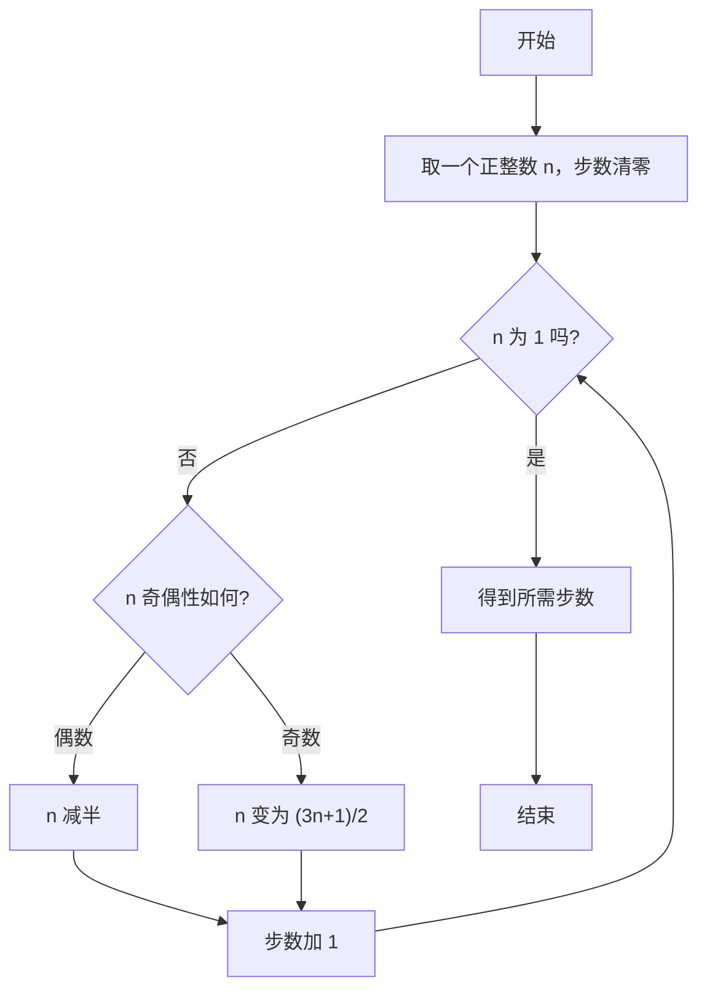

# 1001 害死人不偿命的(3n+1)猜想 详解

### 解题思路
- 本题直接模拟卡拉兹（Collatz）猜想的迭代过程：对任意正整数 n，若为偶数则除以 2，若为奇数则执行 `(3n+1)/2`。
- 数据组织非常简单，只需一个整型变量 n 保存当前数值，一个计数器 count 统计迭代步数。
- 核心判断条件为 `n != 1`：只要 n 尚未收敛到 1 就继续迭代，每次迭代后步数加 1。
- 时间复杂度为 O(log n)，因为每次迭代数值都会缩小（偶数直接减半，奇数经 3n+1 后再减半也大于缩小趋势），n 的迭代次数很小，无需任何额外存储。

### 代码流程说明
1. 程序先读入正整数 n，并将计数器 count 初始化为 0。
2. 进入 `while (n != 1)` 循环：每次迭代先判断 n 的奇偶性——若 `n % 2 == 0` 则执行 `n /= 2`，否则执行 `n = (3 * n + 1) / 2`。
3. 每完成一次变换，count 自增 1，然后回到循环条件重新判断。
4. 当 n 变为 1 时退出循环，最后用 `printf` 输出 count 的值。

### 代码流程图

### 解题流程图

