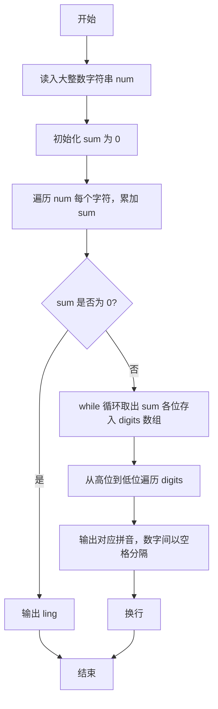
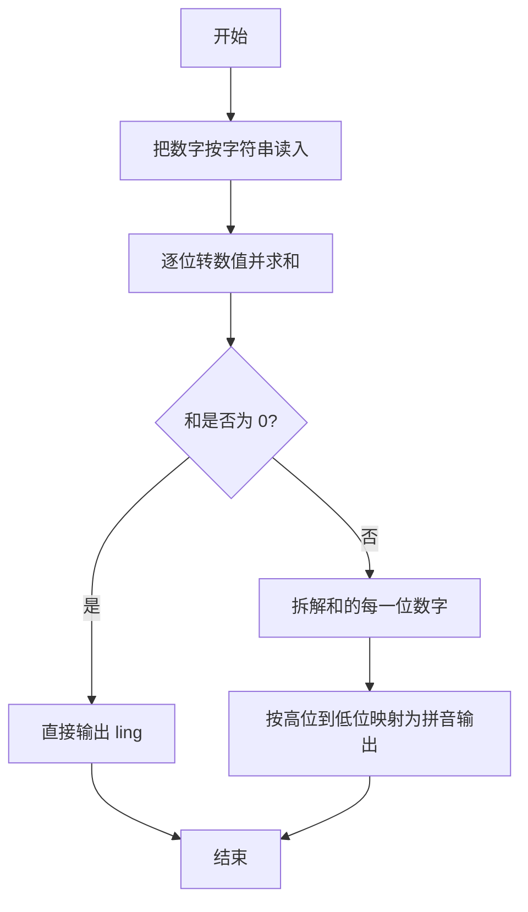

# 1002 写出这个数 详解

### 解题思路
- 输入是一个不超过 100 位的非负整数，远超 long long 范围，因此必须用字符串读入，避免整数溢出。
- 遍历字符串，将每个字符减去 `'0'` 得到对应数值并累加，得到各位数字之和 sum。
- 由于 sum 最大为 9×100=900，位数很少，可用数组 digits 逆序保存 sum 的每一位，再反向遍历即得到从高位到低位的顺序。
- 用拼音二维数组 `pinyin[10][5]` 建立数字 0~9 到拼音的映射，直接按下标取拼音输出。
- 注意特判 sum 为 0 的情况（此时数字只有一位 0），直接输出 "ling"。时间复杂度为 O(L)，L 为输入串长度。

### 代码流程说明
1. 声明 `char num[101]` 存储输入的大整数，初始化拼音表 pinyin 后读入字符串。
2. 用 for 循环遍历 `num`，执行 `sum += num[i] - '0'` 累加各位数字之和。
3. 若 sum 等于 0，直接输出 "ling" 并结束程序。
4. 否则用 while 循环不断取 `sum % 10` 存入 digits 数组并 `sum /= 10`，此时 digits 中是逆序的各位数字。
5. 从 `len - 1` 到 0 逆序遍历 digits，输出对应拼音，除最后一位外以空格分隔，最后换行。

### 代码流程图

### 解题流程图

