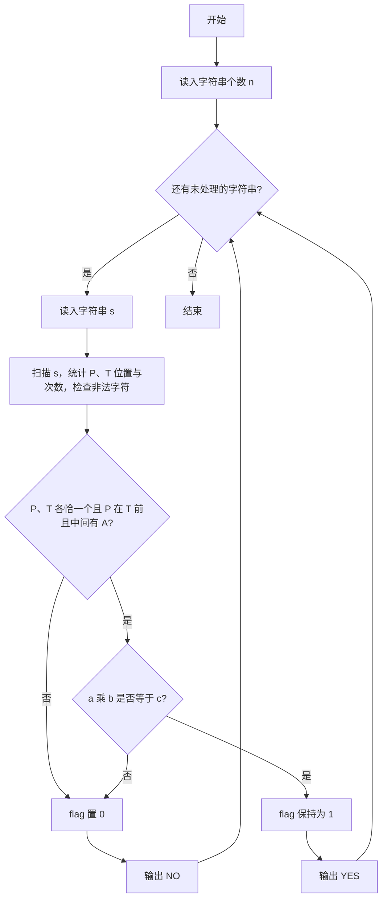
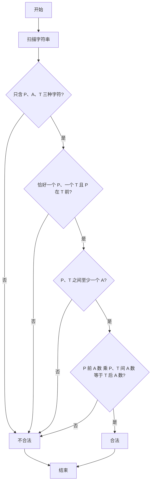

# 1003 我要通过！ 详解

### 解题思路
- 判定字符串是否满足 PAT 认证规则：① 只能含 P、A、T 三种字符；② 恰好一个 P 和一个 T，且 P 在 T 之前、中间至少一个 A；③ 设 P 前、P 与 T 之间、T 后各有 a、b、c 个 A，必须满足 `a * b == c`。
- 用一次扫描统计 P、T 的下标 p、t 和出现次数，同时检查是否出现非法字符。
- 规则③ 是核心：形如 "PAT"、"PAAT"、"AAPATAA" 等都能通过，本质是 `c = a × b` 的递推扩展。
- 每扫描一个字符串只需 O(L) 时间，L 为串长，总共 O(nL) 完成全部判定。

### 代码流程说明
1. 读入待判定个数 n，进入 while 循环逐串处理。
2. 读入字符串 s，用 for 循环扫描：遇到 'P' 记录下标并计数，遇到 'T' 记录下标并计数，遇到非 'A' 字符置 flag 为 0（非法字符）。
3. 扫描结束后检查 `cnt_p != 1 || cnt_t != 1 || p >= t || t - p == 1`：P、T 各恰好一个、P 在 T 前、P 与 T 之间至少一个 A，任一不满足则 flag 置 0。
4. 若 flag 仍为 1，计算 `a = p`、`b = t - p - 1`、`c = len - t - 1`，验证 `a * b == c`，不成立则 flag 置 0。
5. 根据 flag 输出 "YES" 或 "NO"。

### 代码流程图

### 解题流程图

