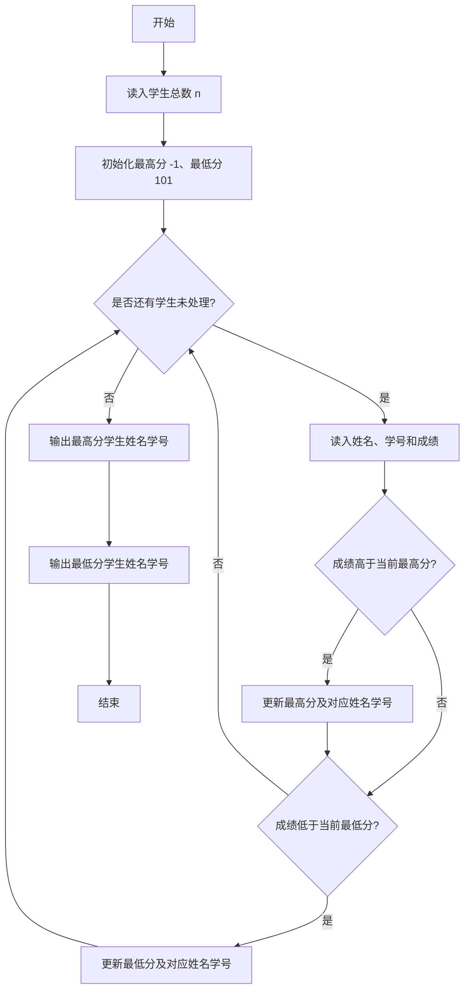
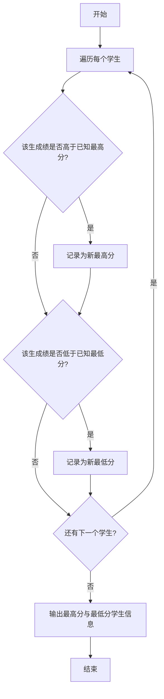

# 1004 成绩排名 详解

### 解题思路
- 题目要求找成绩最高和最低的学生，只需一次遍历即可，无需存储全部学生信息。
- 在读入每个学生的姓名、学号和成绩时，立即与当前维护的最高分、最低分比较并更新。
- 关键技巧是初始值设置：最高分初始化为 -1、最低分初始化为 101，保证第一条记录必然同时更新两者。
- 用四个字符数组分别保存最高分、最低分学生的姓名与学号，比较后通过 strcpy 整体拷贝更新。
- 时间复杂度 O(n)，空间复杂度 O(1)（仅存两个学生的信息）。

### 代码流程说明
1. 读入学生总数 n，声明 max_name、max_id、min_name、min_id 四个字符数组，将 max_score 置 -1、min_score 置 101。
2. 进入 for 循环遍历 n 名学生：每次读入姓名 name、学号 id 和成绩 score。
3. 若 score 大于 max_score，则更新 max_score 并把 name、id 拷入 max_name、max_id。
4. 若 score 小于 min_score，则更新 min_score 并把 name、id 拷入 min_name、min_id。
5. 循环结束后先输出最高分学生的姓名和学号，再输出最低分学生的姓名和学号。

### 代码流程图

### 解题流程图

