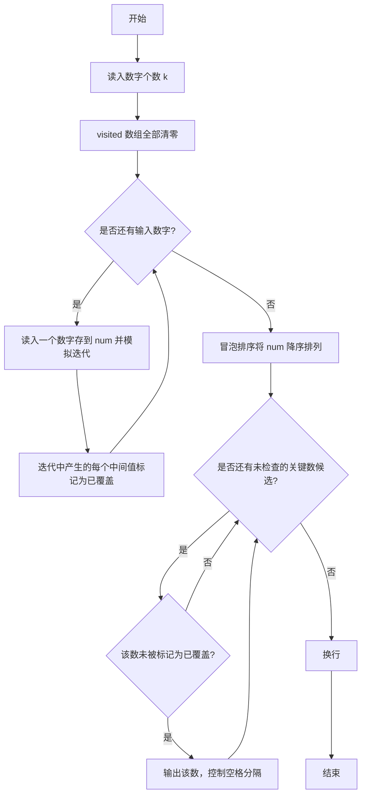
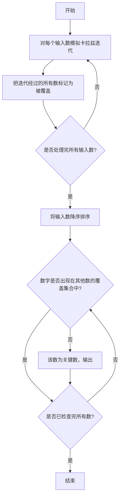

# 1005 继续(3n+1)猜想 详解

### 解题思路
- "关键数"指不被其他任何数字的 (3n+1) 迭代过程覆盖到的数。先模拟每个输入数字的迭代，把过程中出现的所有中间值标记为"被覆盖"。
- 用 `visited[10000]` 数组做哈希标记：迭代产生的每个 n 都令 `visited[n] = 1`，表示该数被覆盖过。
- 注意迭代产生的第一个中间值也要标记，且输入的数本身不需要在迭代前标记（若它出现在别的数迭代中则会被标记）。
- 对输入数字做降序排序（代码用冒泡排序），再依次输出 `visited[num[i]] == 0` 的关键数。
- 排序 O(k²)，迭代模拟每数 O(log n)，总体规模很小，直接冒泡即可。

### 代码流程说明
1. 读入数字个数 k，声明 num 数组和初始全 0 的 visited 数组。
2. 依次读入每个数字：边读入边启动 while 循环模拟迭代——偶数 `n /= 2`，奇数 `n = (3n+1)/2`，每得到一个中间值就标记 `visited[n] = 1`，直到 n 为 1。
3. 双层 for 循环冒泡排序，把 num 按降序排列。
4. 遍历排序后的数组，凡 `visited[num[i]]` 为 0 即为关键数，除第一个外以空格分隔输出，最后换行。

### 代码流程图

### 解题流程图

