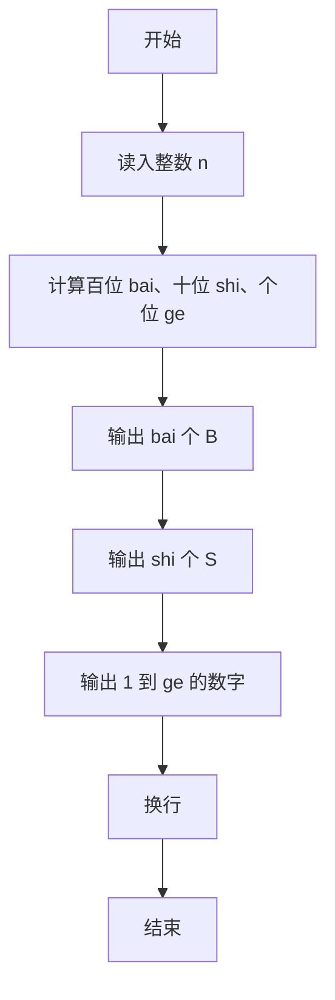
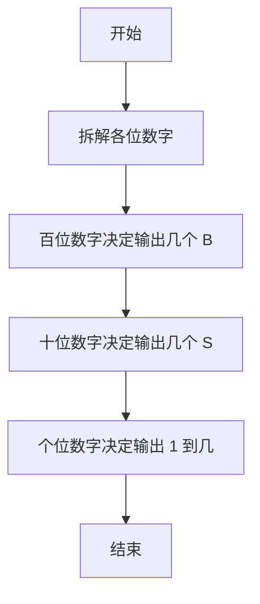

# 1006 换个格式输出整数 详解

### 解题思路
- 输入为不超过 3 位的正整数，直接通过整除与取模拆出百、十、个位数字：`n/100`、`(n/10)%10`、`n%10`。
- 输出规则直观：百位是几就输出几个 'B'，十位是几就输出几个 'S'，个位是 k 就依次输出 1 到 k。
- 位数不足时对应循环执行 0 次即可，天然跳过，无需特判。
- 时间复杂度 O(1)（最多输出几十个字符），空间复杂度 O(1)。

### 代码流程说明
1. 读入整数 n，分别计算 bai、shi、ge 三个位的数字。
2. 第一个 for 循环执行 bai 次，每次输出一个字符 'B'。
3. 第二个 for 循环执行 shi 次，每次输出一个字符 'S'。
4. 第三个 for 循环从 1 到 ge，逐个输出数字 i（即 "123…k"）。
5. 最后输出换行符结束。

### 代码流程图

### 解题流程图

