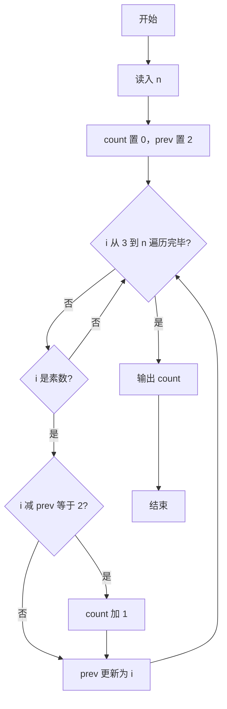
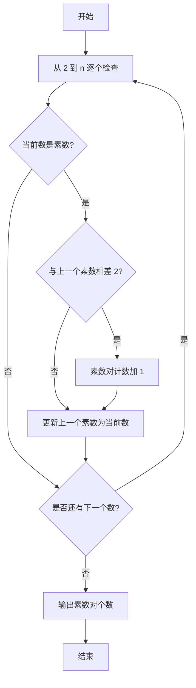

# 1007 素数对猜想 详解

### 解题思路
- 统计不超过 n 的素数中，相邻素数差值为 2 的"孪生素数对"个数。
- 素数判定函数 is_prime 做了若干优化：排除 0、1 与偶数，只从 3 到 sqrt(n) 以步长 2 检查奇数因子，减少一半以上的试除。
- 用变量 prev 记录上一个遇到的素数，每发现一个新素数就与 prev 作差，差为 2 则计数加 1，然后更新 prev。
- 外层从 3 遍历到 n（2 作为初始 prev），每步 O(sqrt(n)) 判定素数，总体复杂度约为 O(n√n)，对题目规模足够。

### 代码流程说明
1. 定义 is_prime(n)：n 小于等于 1 返回 0；n 等于 2 返回 1；n 为偶数返回 0；否则从 3 到 sqrt(n) 步长 2 试除，能整除则返回 0，否则返回 1。
2. main 中读入 n，将 count 置 0、prev 置 2（第一个素数）。
3. for 循环从 3 到 n：若 i 是素数，判断 `i - prev == 2`，成立则 count 加 1，随后更新 prev 为 i。
4. 循环结束后输出 count。

### 代码流程图

### 解题流程图

