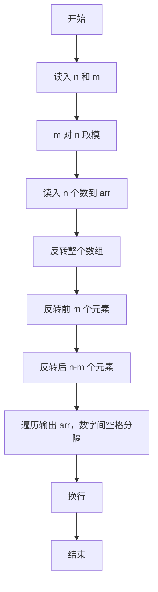
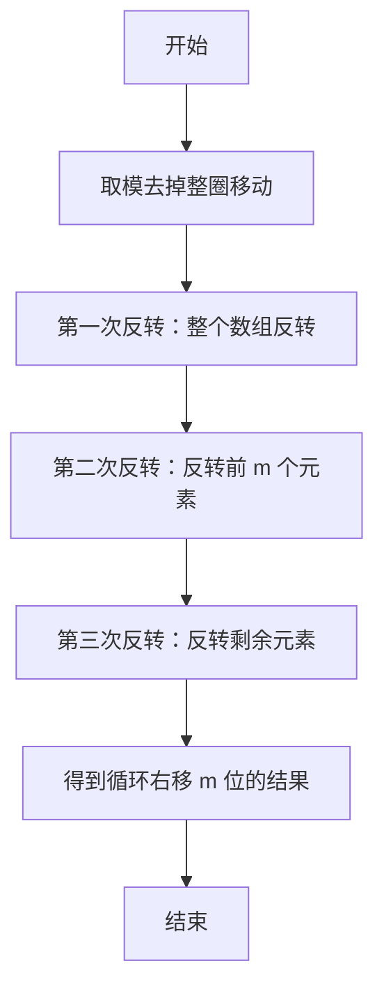

# 1008 数组元素循环右移问题 详解

### 解题思路
- 循环右移 m 位等价于：整体反转 → 反转前 m 个 → 反转后 n-m 个（经典三次反转法），无需额外数组、空间开销极小。
- 移动位数可能超过数组长度，先执行 `m %= n`，把整圈移动去掉，保证 m 小于 n。
- 反转函数 reverse 用首尾指针交换元素并向中间靠拢实现。
- 时间复杂度 O(n)：三次反转合计约 n 次交换；空间复杂度 O(1)。

### 代码流程说明
1. 定义 reverse(arr, start, end)：while 循环中交换 arr[start] 与 arr[end]，然后 start 自增、end 自减，直到 start 不小于 end。
2. main 中读入 n、m，先 `m %= n` 规范化移动位数。
3. 读入 n 个数到 arr 数组。
4. 依次调用三次反转：整体 `reverse(arr, 0, n-1)`、前段 `reverse(arr, 0, m-1)`、后段 `reverse(arr, m, n-1)`。
5. 遍历输出 arr，数字间以空格分隔（最后一个数字后不输出空格），最后换行。

### 代码流程图

### 解题流程图

