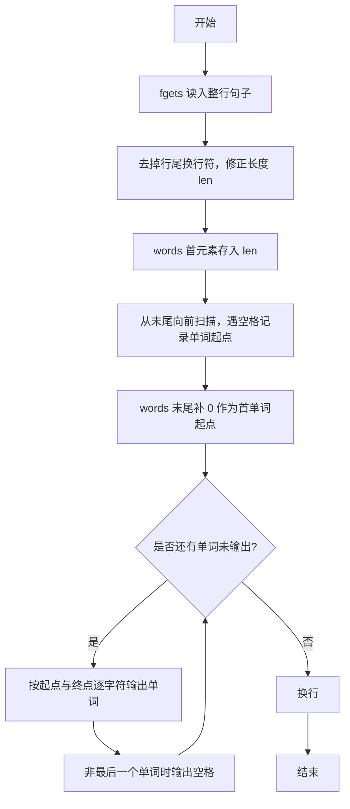
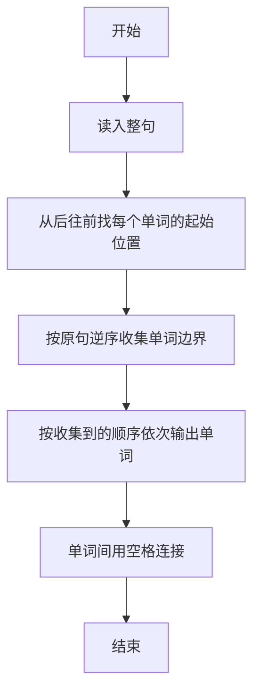

# 1009 说反话 详解

### 解题思路
- 目标是把句子中的单词顺序颠倒输出。用 fgets 读入整行（含空格），并去掉行尾换行符。
- 不逐个拷贝单词，而是记录每个单词的起始下标：从字符串末尾向前扫描，每遇到一个空格，其后的位置就是一个单词的起点。
- words 数组首元素存字符串长度（作为第一个被输出单词的结束边界），中间按逆序记录各单词起点，末尾补 0（原第一个单词的起点）。
- 输出时对每个单词取 [start, end) 区间逐个打印字符，单词间以空格分隔。
- 一次扫描加一次输出，时间复杂度 O(L)，L 为句子长度。

### 代码流程说明
1. `fgets(str, 81, stdin)` 读入整行句子，用 while 循环去掉末尾可能存在的 '\n' 或 '\r'，同时把长度 len 修正。
2. 将 len 写入 words[0]，wlen 置 1。
3. 从 len-1 向前扫描：遇到空格就把 `i+1` 记入 words（该空格后是单词起点），得到逆序的单词起点序列。
4. 末尾再写入 0（原句首单词的起点），使 words 完整记录各单词边界。
5. 从 i=1 到 wlen-1 输出单词：起点为 words[i]，终点为 words[i-1] 或 words[i-1]-1（去掉空格），逐字符 printf；除最后一个单词外输出空格，最后换行。

### 代码流程图

### 解题流程图

