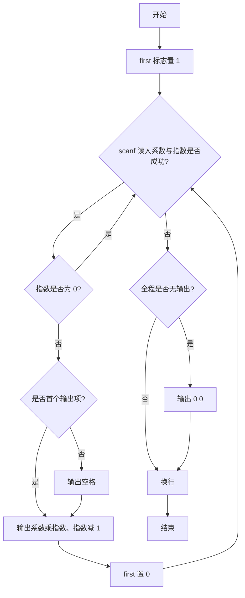
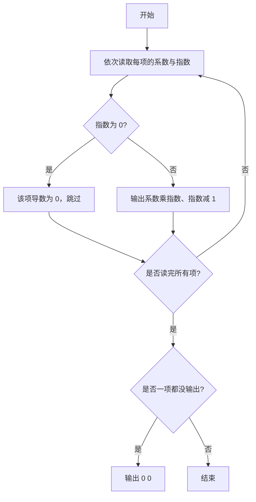

# 1010 一元多项式求导 详解

### 解题思路
- 输入以"系数 指数"成对形式给出多项式各项，求导规则：对 `a*x^e`，导数为 `(a*e)*x^(e-1)`。
- 用 `while (scanf("%d %d", &coeff, &exp) != EOF)` 连续读入，直到文件结束，天然适配"行数未知"的输入。
- 指数为 0 的项（常数项）导数为 0，直接 continue 跳过不输出。
- 用 first 标志控制格式：非首项前输出一个空格。若全程无输出（多项式只有常数项），则按题目要求补输出 "0 0"。
- 时间复杂度 O(n)，n 为项的个数。

### 代码流程说明
1. 声明 coeff、exp 两个变量和 first 标志（初值 1）。
2. 进入 while 循环读入系数与指数，读到 EOF 退出。
3. 若 exp 为 0，continue 跳过该项。
4. 否则若非首项先输出空格，然后输出 `coeff * exp` 和 `exp - 1`，并把 first 置 0。
5. 循环结束后若 first 仍为 1（没有任何输出），输出 "0 0"；最后统一换行。

### 代码流程图

### 解题流程图

