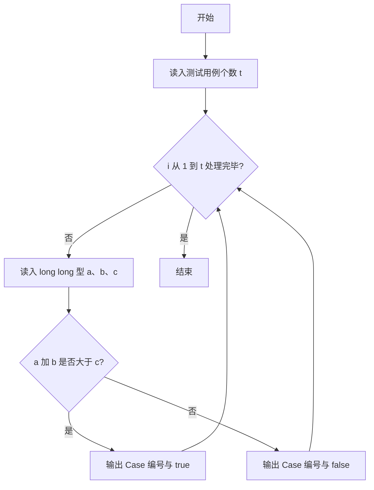
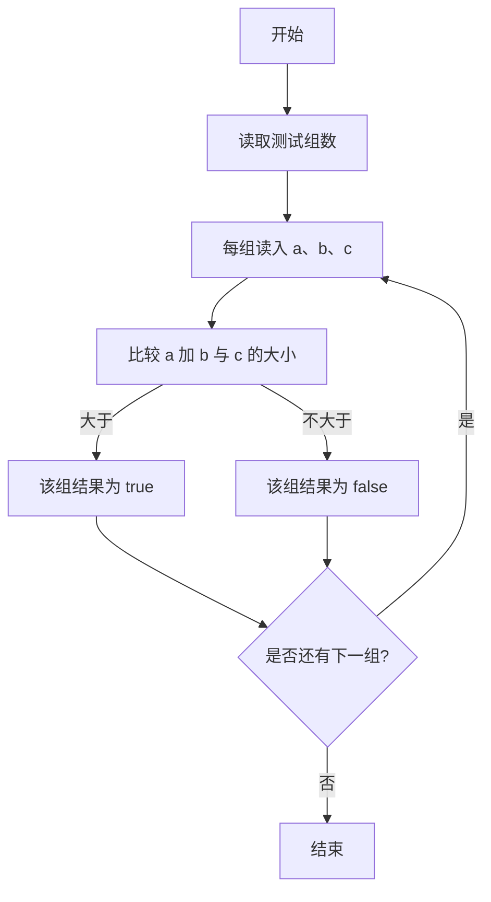

# 1011 A+B 和 C 详解

### 解题思路
- 题目给出的整数范围是 [-2^63, 2^63)，正好超过 32 位整型，必须用 long long 存储 a、b、c，否则相加会溢出。
- 对每组数据只需判断 `a + b > c` 并输出 "true" 或 "false"。
- 输出格式固定为 `Case #序号: true/false`，序号从 1 开始。
- 一次读入、一次判断，时间复杂度 O(t)，t 为测试用例数。

### 代码流程说明
1. 读入测试用例个数 t。
2. 进入 for 循环，i 从 1 到 t：用 `%lld` 读入三个 long long 型整数 a、b、c。
3. 直接以三目表达式判断 `a + b > c`，按 `Case #i: ` 前缀输出 true 或 false，换行。
4. 循环结束，程序返回。

### 代码流程图

### 解题流程图

