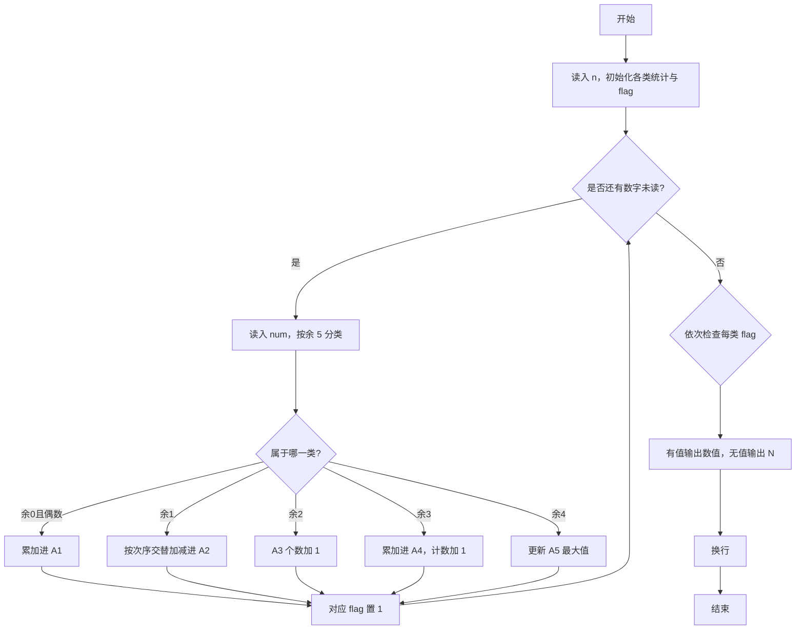
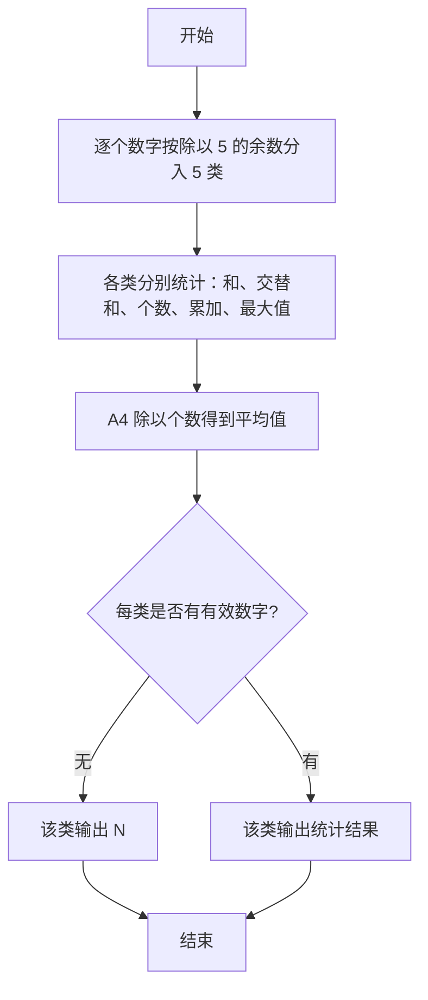

# 1012 数字分类 详解

### 解题思路
- 按数字除以 5 的余数分为 5 类统计，各类规则不同：A1 是能被 5 整除的偶数之和；A2 是余 1 的数交替加减；A3 是余 2 的个数；A4 是余 3 的平均值；A5 是余 4 的最大值。
- A2 的交替加减用计数器 cnt2 的奇偶判断：第奇数个加、第偶数个减。
- A4 用 double 累加、最后除以个数 cnt4，输出保留一位小数。
- 每个分类配一个 flag，用于判断该分类是否有有效数字；没有有效数字时输出字符 N。
- 一次遍历即可完成全部统计，时间复杂度 O(n)。

### 代码流程说明
1. 读入数字个数 n，初始化各类统计变量和 flag 标志全为 0。
2. for 循环逐个读入 num，计算 `mod = num % 5` 后按类处理：mod 为 0 且 num 为偶数累加到 a1；mod 为 1 按 cnt2 奇偶做加或减；mod 为 2 时 a3 加 1；mod 为 3 时 a4 累加且 cnt4 加 1；mod 为 4 时更新 a5 最大值。
3. 每次命中某类时把对应 flag 置 1。
4. 依次输出 5 个结果：flag 为 0 输出 N，否则输出数值，其中 A4 输出 `a4 / cnt4` 保留一位小数，各项之间以空格分隔，最后换行。

### 代码流程图

### 解题流程图

