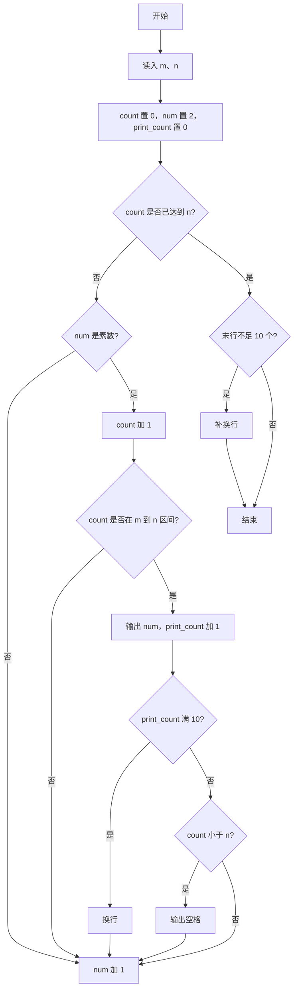
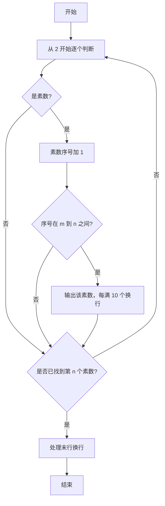

# 1013 数素数 详解

### 解题思路
- 依次从 2 开始递增判断每个数是否为素数，记录素数的序号 count，只输出序号落在 [m, n] 区间内的素数。
- 素数判定 is_prime 做了优化：排除 0、1 与偶数，只从 3 到 sqrt(n) 以步长 2 检查奇数因子。
- 用 print_count 控制排版：每行输出 10 个素数，满 10 个换行，行内以空格分隔；最后一个素数后不输出多余空格。
- 循环条件是 `count < n`，找到第 n 个素数即停止；末行若不足 10 个则补一个换行。
- 时间复杂度 O(n√p)，p 为第 n 个素数的大小。

### 代码流程说明
1. 定义 is_prime 函数：n 小于等于 1 返回 0，等于 2 返回 1，为偶数返回 0，否则从 3 到 sqrt(n) 步长 2 试除。
2. main 中读入 m、n，count 置 0、num 置 2、print_count 置 0。
3. while 循环直到 count 达到 n：若 num 是素数则 count 加 1；当 count 落在 [m, n] 时输出 num，print_count 加 1；若 print_count 是 10 的倍数则换行，否则若还不是最后一个素数（count < n）则输出空格；随后 num 加 1。
4. 循环结束后若末行不足 10 个（print_count % 10 != 0），补输出一个换行。

### 代码流程图

### 解题流程图

