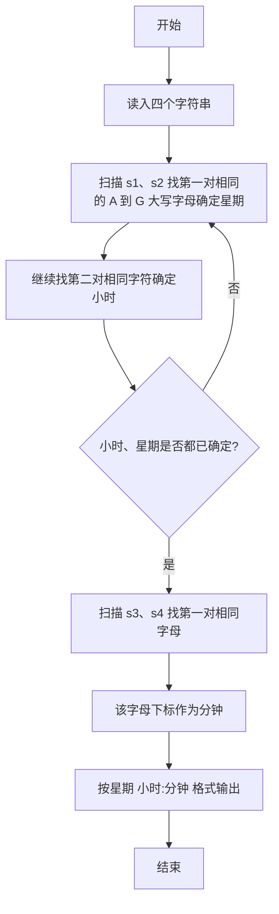
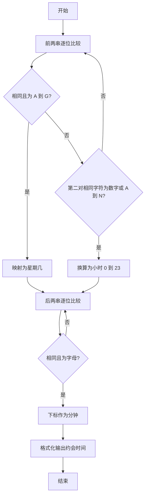

# 1014 福尔摩斯的约会 详解

### 解题思路
- 从四行字符串中按规则提取约会信息：星期、小时、分钟，两两配对比较。
- 第一对字符串 s1、s2 中逐位找相同字符：第一个相同的 A~G 大写字母决定星期；之后继续找第二对相同字符，是 0~9 决定小时 0~9 点，是 A~N 则换算成 10~23 点。
- 第二对字符串 s3、s4 中第一个相同且是字母（大小写均可）的位置下标即分钟。
- 只需比较两串较短的长度；用 found1、found2 标志确保先找星期再找小时，二者齐全即可提前结束。
- 小时和分钟输出各占两位（不足补 0）。时间复杂度 O(L)，L 为串长。

### 代码流程说明
1. 读入四个字符串 s1~s4，定义星期缩写数组 days，取 s1、s2 较短长度 min_len。
2. 第一个 for 循环扫描 s1、s2：未定星期时若发现相同的 A~G 大写字母，则 `day = s1[i] - 'A'` 并置 found1；已定星期时若发现相同字符，数字直接作为 hour，字母 A~N 用 `s1[i] - 'A' + 10` 换算，并置 found2。found1 与 found2 都满足时 break。
3. 对 s3、s4 同样取较短长度，第二个 for 循环找第一对相同字母，把下标 i 存入 minute 并 break。
4. 用 `printf("%s %02d:%02d\n", days[day], hour, minute)` 输出结果。

### 代码流程图

### 解题流程图

