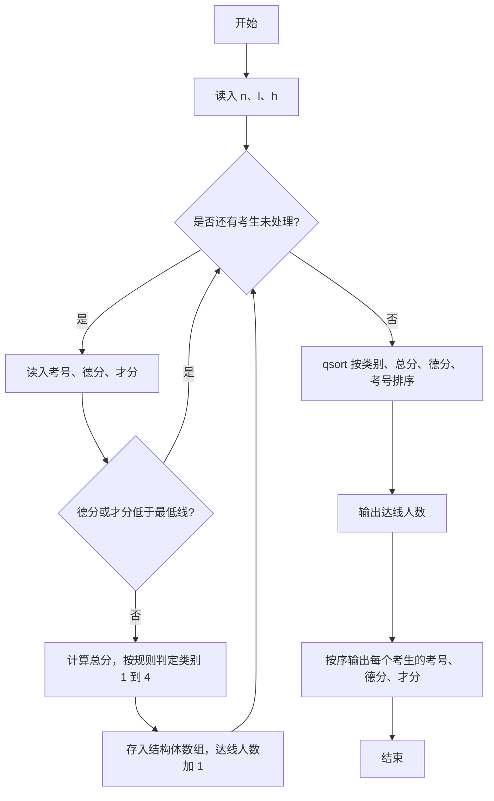
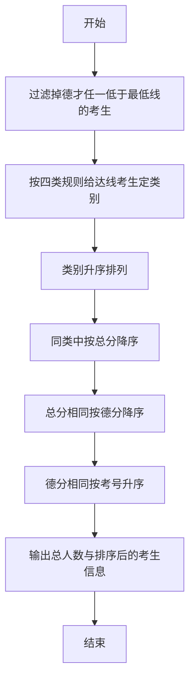

# 1015 德才论 详解

### 解题思路
- 先把德分或才分低于最低线 l 的考生直接淘汰，只对达线考生分类排序。
- 分类规则：德才都不低于 h 为第 1 类；德不低于 h、才低于 h 为第 2 类；德才都低于 h 但德分不小于才分为第 3 类；其余达线考生为第 4 类。
- 排序规则（cmp 比较函数）：先按类别升序（1 最前），同类按总分降序，总分相同按德分降序，德分仍相同按准考证号升序。
- 用结构体 Student 组织考生信息（id、de、cai、total、rank），交给标准库 qsort 快速排序。
- 时间复杂度 O(n log n)（排序主导），n 最大 10 万。

### 代码流程说明
1. 定义 Student 结构体与 cmp 比较函数：依次比较 rank、total、de、id，实现"类别优先、总分次之、德分再次、考号最后"的四级排序。
2. main 中读入 n、l、h，声明 Student 数组，m 记录达线人数。
3. 逐行读入 id、de、cai：若 `de < l || cai < l` 则 continue 淘汰；否则填入结构体并计算 total，按四条规则判定 rank，m 自增。
4. 调用 `qsort(stu, m, sizeof(Student), cmp)` 排序，先输出达线人数 m，再按序逐行输出准考证号、德分、才分。

### 代码流程图

### 解题流程图

