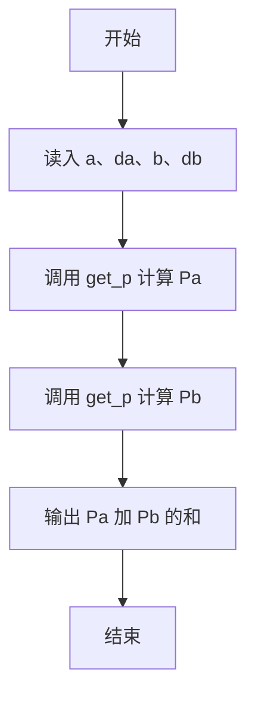
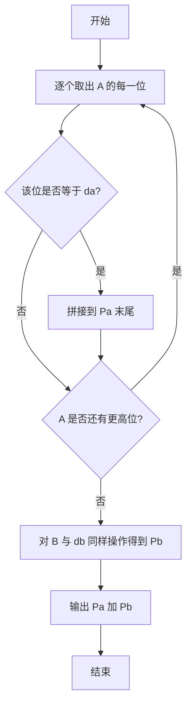

# 1016 部分A+B 详解

### 解题思路
- 从整数 A 中找出所有等于 da 的数字，将它们依次拼接成新数 Pa；同理从 B 中拼出 Pb，输出 Pa + Pb。
- 用函数 get_p 实现提取与拼接：while 循环逐位检查 `a % 10` 是否等于 da，等于则通过 `p = p * 10 + da` 把该数字追加到结果末尾，然后 `a /= 10` 去掉最低位。
- 拼接顺序不影响结果（如 66、666 等由相同数字组成），逐位处理即可。
- 时间复杂度 O(log A + log B)，仅需一个辅助变量，空间 O(1)。

### 代码流程说明
1. 定义 get_p(a, da)：p 初始为 0，循环中当前位等于 da 时追加到 p 末尾，循环结束后返回 p。
2. main 中用 `%lld` 和 `%d` 分别读入 a、da、b、db。
3. 计算 `get_p(a, da) + get_p(b, db)` 并输出结果。

### 代码流程图

### 解题流程图

