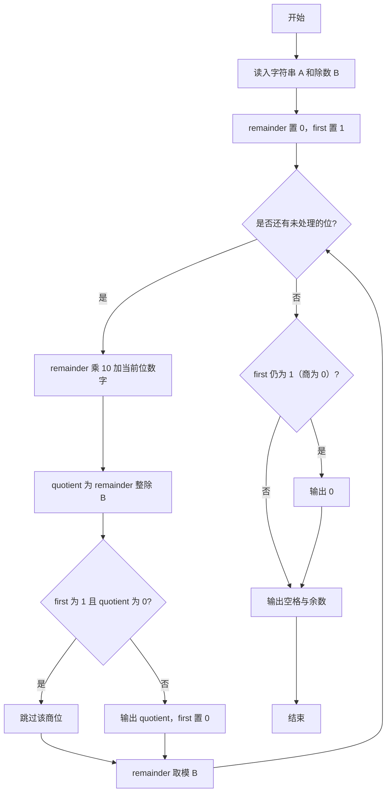
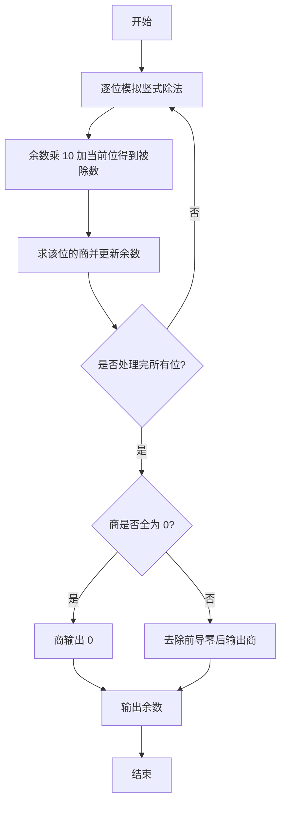

# 1017 A除以B 详解

### 解题思路
- A 是不超过 1000 位的正整数，远超内置整数范围，须按字符串逐位模拟竖式除法；B 是一位正整数，余数始终小于 10，因此只需一个 int 余数即可。
- 从高位到低位处理每一位：把当前余数乘 10 加上本位数字构成被除数，`/ b` 得到该位商，`% b` 更新余数。
- 用 first 标志跳过商的前导零：只要还没输出过有效位，且当前商位为 0 就不输出。
- 特判商全为 0（即 A < B）时补输出一个 0；最后输出余数。时间复杂度 O(L)，L 为 A 的位数。

### 代码流程说明
1. 用字符串 a 读入被除数、整数 b 读入除数，取长度 len。
2. first 置 1、remainder 置 0。
3. for 循环从高位到低位：`remainder = remainder * 10 + (a[i] - '0')`，计算 quotient 为该值整除 b 的结果。
4. 若 `!first || quotient != 0` 则输出该商位并把 first 置 0（实现去前导零）。
5. `remainder %= b` 更新余数，进入下一位。
6. 循环结束后若 first 仍为 1（说明商为 0），输出 "0"；最后以空格分隔输出余数并换行。

### 代码流程图

### 解题流程图

