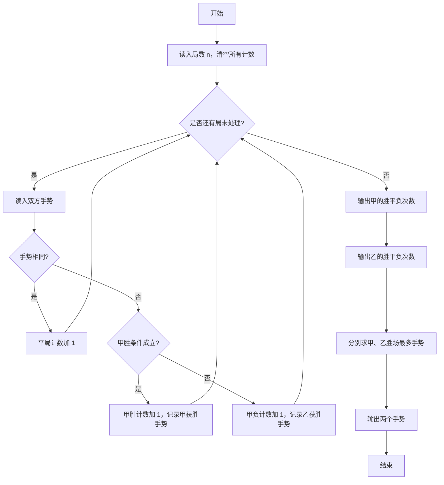
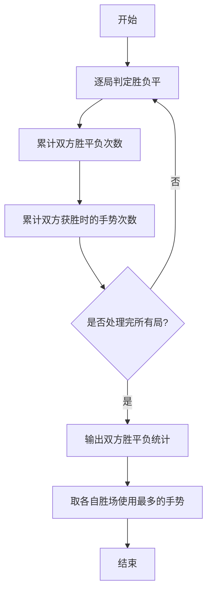

# 1018 锤子剪刀布 详解

### 解题思路
- 统计甲胜、平、负的次数，以及甲获胜时各手势、乙获胜时各手势的使用次数，一轮扫描完成所有统计。
- 胜负判定规则：C（锤子）胜 J（剪刀）、J 胜 B（布）、B 胜 C（锤子），用三个 or 条件判断甲是否获胜；手势相同则平局，否则甲负（即乙胜）。
- 输出时乙的胜平负次数与甲互为镜像：乙胜 = 甲负、乙平 = 甲平、乙负 = 甲胜。
- 求"胜场中使用次数最多"的手势时用三目嵌套比较，次数相同时取字母序较小者（B < C < J），代码通过 `>=` 的比较顺序天然满足该优先级。
- 时间复杂度 O(n)，n 为局数。

### 代码流程说明
1. 读入局数 n，初始化甲胜平负计数与甲乙双方各手势计数为 0。
2. for 循环每局读入 jia、yi 两个字符：相同则平局计数加 1；满足三组胜条件之一则甲胜，并按 jia 的手势累加对应计数；否则甲负，按 yi 的手势累加乙的计数。
3. 依次输出甲的胜平负、乙的胜平负（jia_lose、jia_draw、jia_win）。
4. 用嵌套三目表达式分别求出甲、乙胜场中使用最多的手势，输出两字符。

### 代码流程图

### 解题流程图

