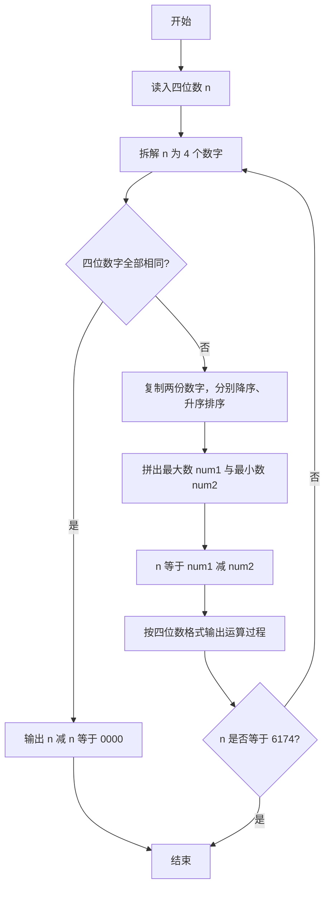
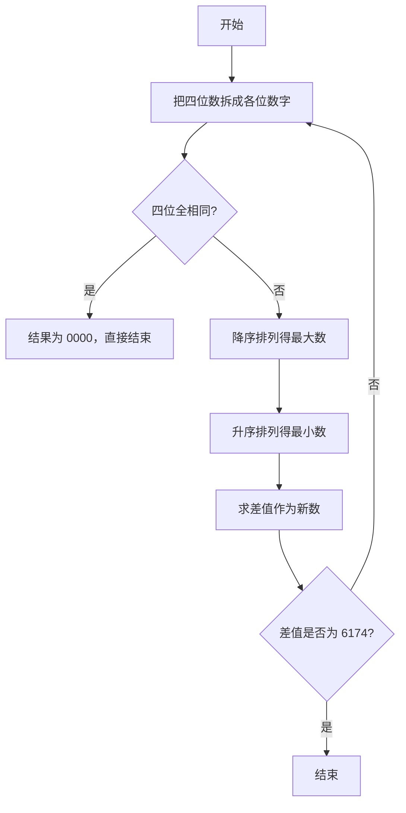

# 1019 数字黑洞 详解

### 解题思路
- 对四位数反复执行"降序排列成最大数 − 升序排列成最小数"，直到得到 6174 或 0；每一步结果都要以 4 位格式输出。
- 用 to_digits 把数拆成 4 个数字，to_num 把数字拼回 4 位数，sort_desc / sort_asc 用简单冒泡完成排序。
- 先判断四位是否全相同：全相同则一次减法后必为 0，题目要求直接输出 `xxxx - xxxx = 0000` 并结束。
- 输出用 `%04d` 保证补零对齐；得到 6174 时终止循环。
- 四位数每次变换最多几步即收敛，运算量极小；每轮排序比较次数固定为常数。

### 代码流程说明
1. 读入整数 n，声明 digits 数组。
2. 进入无限循环：先把 n 拆成 4 个数字，检查是否四位全相同——相同则按格式输出差值 0000 并 break。
3. 否则复制出 d1、d2 两份，分别降序、升序排序，经 to_num 拼出最大数 num1 和最小数 num2。
4. `n = num1 - num2`，按 `%04d - %04d = %04d` 格式输出本轮过程。
5. 若 n 等于 6174 则 break，否则继续下一轮。

### 代码流程图

### 解题流程图

