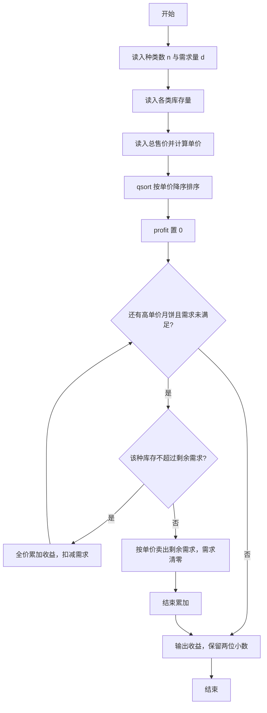
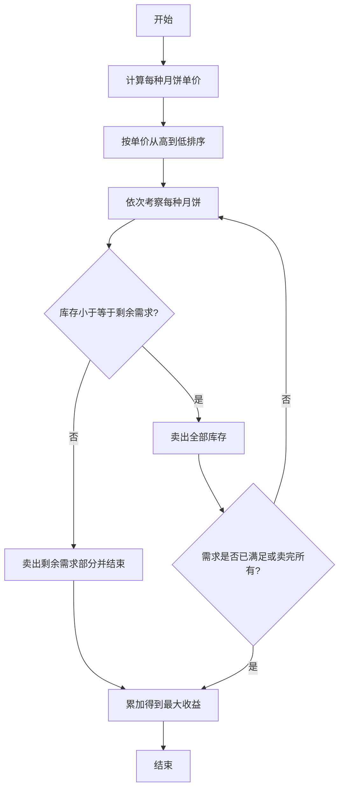

# 1020 月饼 详解

### 解题思路
- 经典贪心：要使收益最大，应优先卖出单价（总售价 ÷ 库存量）最高的月饼，直至满足市场需求。
- 结构体 Mooncake 保存库存 stock、总售价 price 与单价 unit_price；用 qsort 按单价降序排列，比较函数 cmp 以单价为准返回正负。
- 遍历排序后的月饼：若库存不超过剩余需求则整类全卖并累加全价，否则只卖需求所需数量（单价 × 剩余需求量）并清零需求。
- 库存、售价、单价均用 double 避免浮点精度损失，收益保留两位小数输出。
- 时间复杂度 O(n log n)，空间 O(n)。

### 代码流程说明
1. 读入月饼种类数 n 和市场需求量 d，声明 Mooncake 数组。
2. 先循环读入各类库存量，再循环读入总售价并计算 `unit_price = price / stock`。
3. qsort 按单价降序排列所有月饼。
4. profit 初始为 0，for 循环从高单价到低单价：`stock <= d` 时全价累加并扣减库存；否则累加 `unit_price * d` 并把 d 置 0，随后因条件 `d > 0` 不满足而结束循环。
5. 输出 profit，保留两位小数。

### 代码流程图

### 解题流程图

