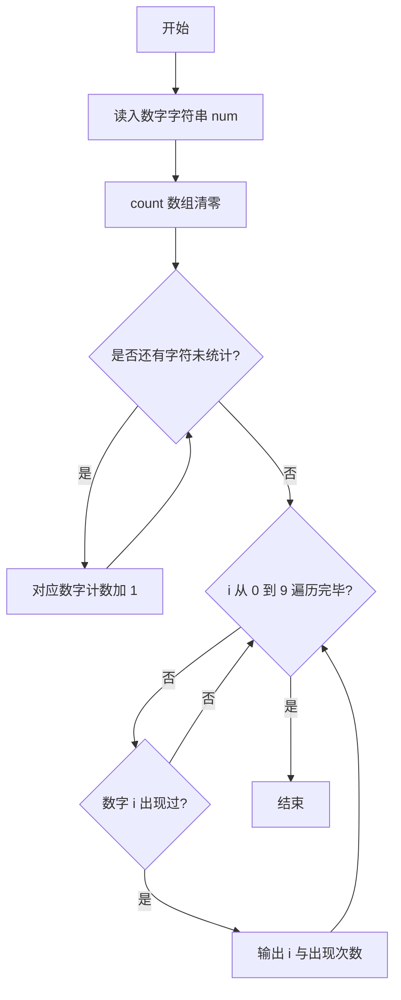
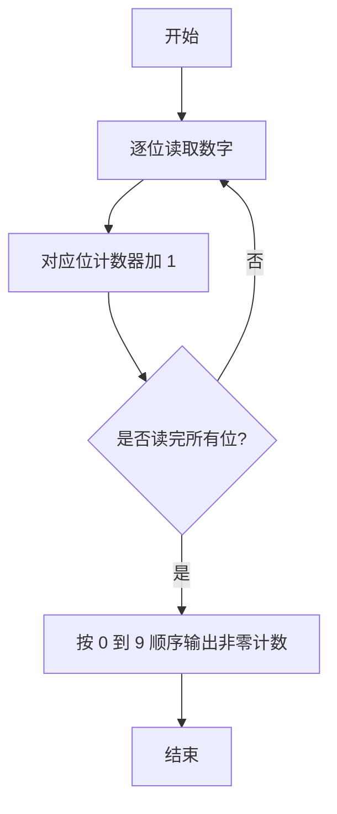

# 1021 个位数统计 详解

### 解题思路
- 输入可能长达 1000 位，远超整数范围，必须用字符串读取；每位数字只需用 `num[i] - '0'` 转成数值。
- 用长度为 10 的 count 数组做计数表：遍历字符串，每读到一个数字就让对应下标的计数加 1。
- 最后按数字 0 到 9 的顺序遍历 count，只输出出现次数大于 0 的数字及其次数，格式为 `数字:次数`。
- 时间复杂度 O(L)，L 为字符串长度；空间固定 O(1)。

### 代码流程说明
1. 声明 `char num[1001]` 读入数字字符串，count 数组初始化全 0。
2. for 循环遍历字符串，执行 `count[num[i] - '0']++` 完成逐位统计。
3. for 循环遍历 0 到 9：`count[i] > 0` 时输出 `i:count[i]` 并换行。

### 代码流程图

### 解题流程图

