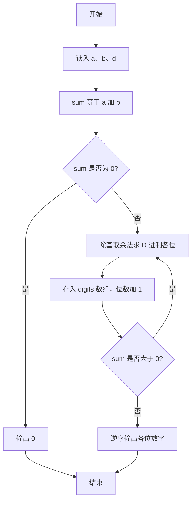
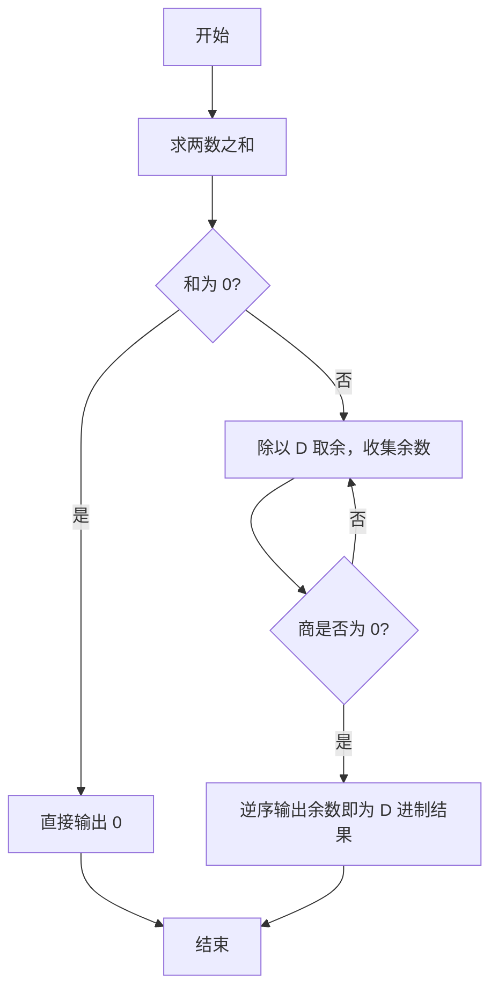

# 1022 D进制的A+B 详解

### 解题思路
- 先求 `sum = a + b`，再用"除基取余法"把十进制和转换成 D 进制：反复 `sum % d` 取余并 `sum /= d`，余数逆序排列即为结果。
- A、B 可达 2^30 量级，相加后需用 long long 存储避免溢出。
- 特判 sum 为 0：转换循环无法执行，直接输出 0。
- 用 digits 数组逆序存放各位余数，最后从高位到低位输出。时间复杂度 O(log_d(sum))。

### 代码流程说明
1. 读入 a、b、d，计算 `sum = a + b`。
2. 若 sum 为 0，直接输出 "0" 并结束。
3. while 循环 `sum > 0`：把 `sum % d` 存入 digits 数组并令 `sum /= d`，len 记录位数。
4. 从 len-1 到 0 逆序输出 digits 中的每一位，最后换行。

### 代码流程图

### 解题流程图

