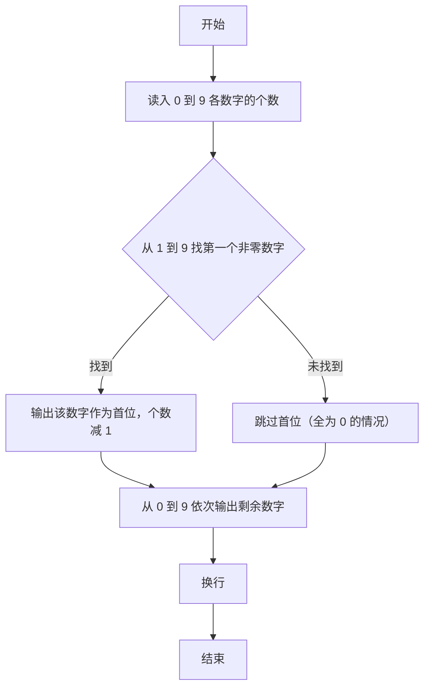
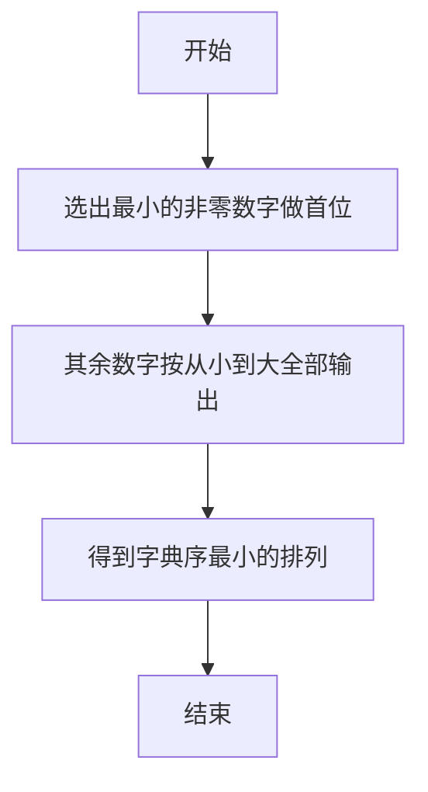

# 1023 组个最小数 详解

### 解题思路
- 目标是用给定数量的 0~9 数字拼成最小数，关键是首位不能为 0。
- 第一步从 1 到 9 找第一个计数大于 0 的最小数字作为首位输出并消耗一个；第二步把 0 到 9 剩余数字按从小到大全部输出。
- 剩余数字升序输出即可保证整体最小，因为"首位最小 + 其余升序"是字典序最小的组合。
- 只需两个循环，时间复杂度 O(10 + 总数字个数)，空间 O(1)。

### 代码流程说明
1. 读入 cnt[0]~cnt[9] 十个计数。
2. 第一个 for 循环从 1 到 9 找最小的非零数字：找到就输出该数字、计数减 1 并 break。
3. 第二个 for 循环从 0 到 9：对每个数字输出 cnt[i] 次。
4. 输出换行结束。

### 代码流程图

### 解题流程图

