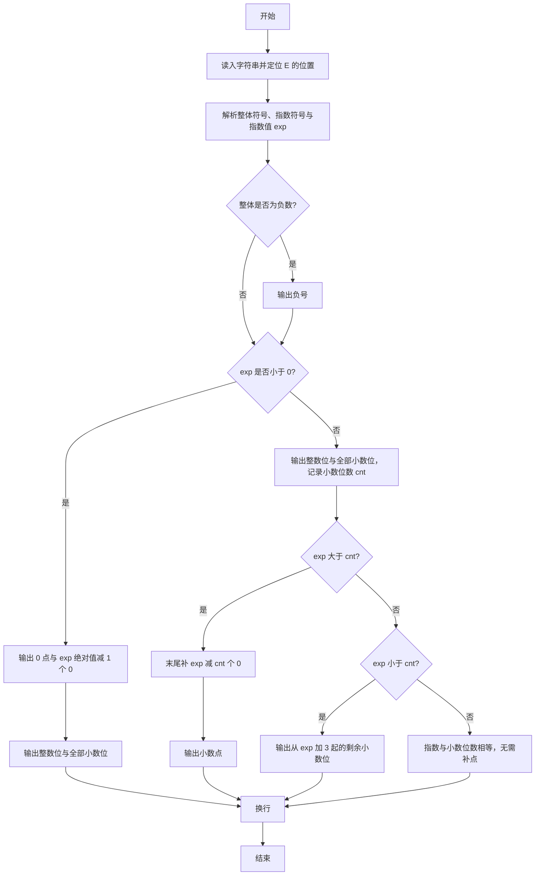
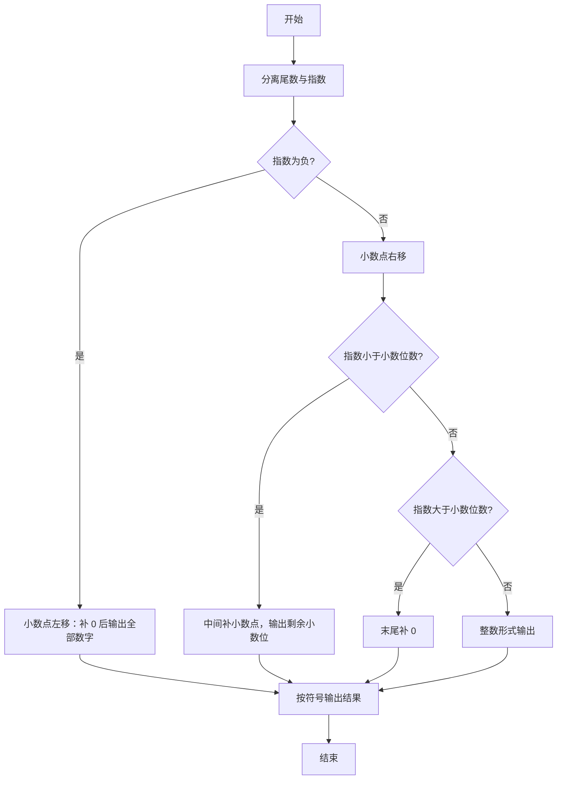

# 1024 科学计数法 详解

### 解题思路
- 输入格式为 `A[.B]E±C`，其中 A 是一位整数，B 是若干位小数，C 是整数指数。字符串中只含一个小数点和一个 E。
- 先定位 E 的位置 e_pos，取出整体符号 sign（s[0]）和指数符号，并解析指数绝对值得到带符号的 exp。
- 按指数正负分两路处理：exp 为负说明小数点左移，结果形如 `0.00…`（先输出 |exp|-1 个 0，再输出全部有效数字）；exp 非负说明小数点右移，先输出整数部分 A，再输出全部小数位，然后根据 exp 与小数位数 cnt 的关系决定末尾补 0 还是中间补小数点。
- 负号统一在开头输出。纯字符串操作，时间复杂度 O(L)，L 为输入长度。

### 代码流程说明
1. 读入字符串 s，用 while 循环找到 E 的下标 e_pos，记录 sign = s[0]，指数符号由 `s[e_pos+1]` 是否为 '-' 决定。
2. 从 e_pos+2 起累加解析指数绝对值，再乘符号得到 exp。
3. 若 sign 为 '-'，先输出负号。
4. exp 为负时：输出 "0."，再输出 `-exp-1` 个 0，然后输出 s[1]（整数部分）和从下标 3 到 e_pos 的全部小数位。
5. exp 非负时：输出 s[1]，统计并输出全部小数位得到 cnt；若 `exp - cnt > 0` 则末尾补相应个数的 0；若 `exp < cnt` 则输出小数点并把从 `exp+3` 到 e_pos 的剩余小数位输出。
6. 最后换行。

### 代码流程图

### 解题流程图

