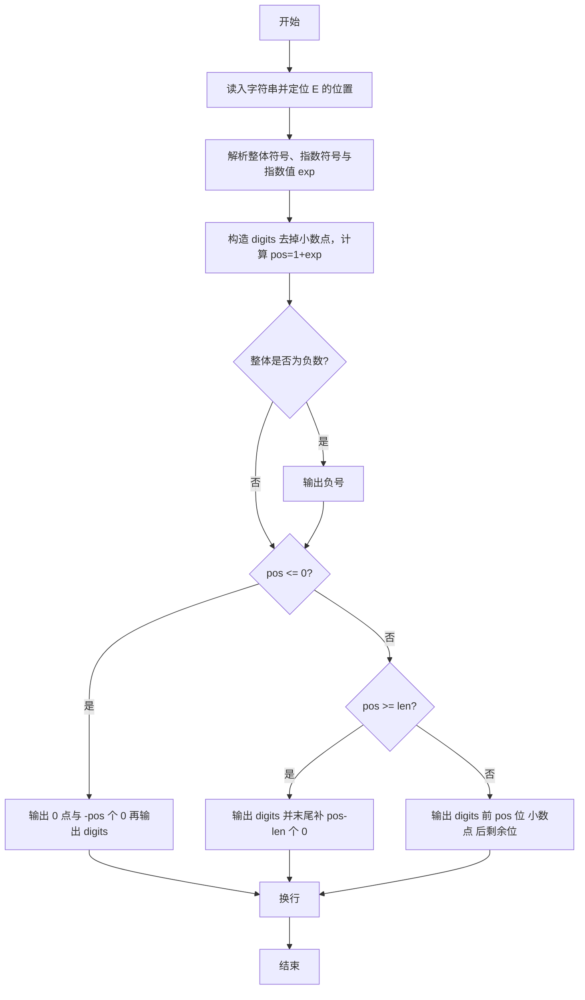
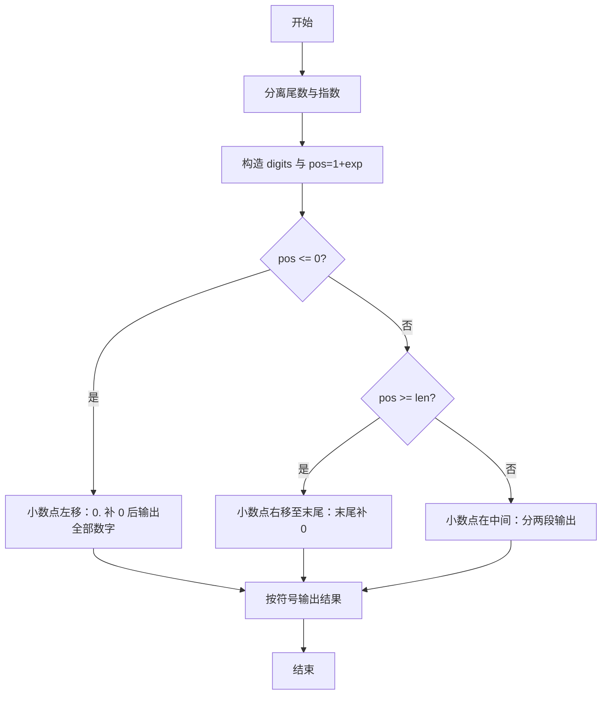

# 1024 科学计数法 详解

### 解题思路
- 输入格式为 `A[.B]E±C`，其中 A 是一位整数，B 是若干位小数，C 是整数指数。字符串中只含一个小数点和一个 E。
- 先定位 E 的位置 e_pos，取出整体符号 sign（s[0]）和指数符号，并解析指数绝对值得到带符号的 exp。
- 设 `digits = 去掉点的数字部分`（即 s[1] + s[3..e_pos-1]），`pos = 1+exp` 表示小数点应在 digits 中的插入位置，分三路处理：
  - `pos<=0` -> `0.` + `(-pos)` 个 0 + digits（小数点左移到 0 前面）；
  - `pos>=len(digits)` -> digits + `pos-len` 个 0（小数点右移到末尾后补 0）；
  - 否则 digits[:pos] + '.' + digits[pos:]（小数点在中间）。
- 负号统一在开头输出。纯字符串操作，时间复杂度 O(L)，L 为输入长度。

### 代码流程说明
1. 读入字符串 s，用 while 循环找到 E 的下标 e_pos，记录 sign = s[0]，指数符号由 `s[e_pos+1]` 是否为 '-' 决定。
2. 从 e_pos+2 起累加解析指数绝对值，再乘符号得到 exp。
3. 构造 digits：先放入 s[1]，再依次放入 s[3] 到 e_pos-1 的全部小数位，得到 dlen；计算 pos = 1+exp。
4. 若 sign 为 '-'，先输出负号。
5. 按 pos 分三路输出：
   - `pos<=0`：输出 "0."，再输出 `-pos` 个 0，最后输出 digits；
   - `pos>=dlen`：输出 digits，再输出 `pos-dlen` 个 0；
   - 否则：输出 digits[0:pos]，再输出 '.'，最后输出 digits[pos:dlen]。
6. 最后换行。

### 代码流程图

### 解题流程图

