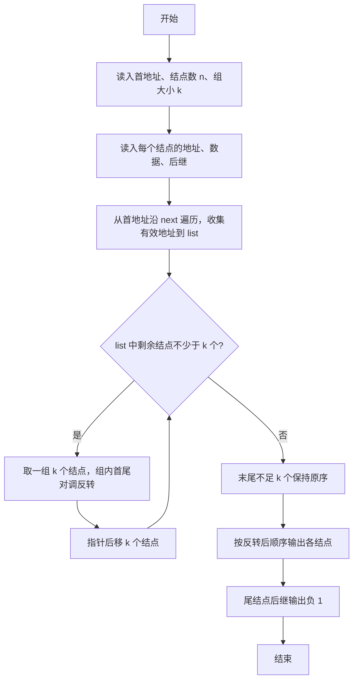
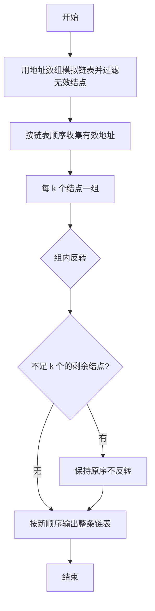

# 1025 反转链表 详解

### 解题思路
- 地址是 5 位非负整数，可用"地址作下标"的静态数组模拟链表：nodes[addr] 存 data 和 next，读写都是 O(1)。
- 输入可能含不在链表上的孤立结点，因此要沿 next 指针从 start 出发遍历，把有效结点地址按序收集到 list 数组，天然过滤无效结点。
- 每 k 个一组做局部反转：外层循环 `i += k` 定位每组的起点，组内用首尾对调（`list[i+j]` 与 `list[i+k-1-j]` 交换）完成反转；末尾不足 k 个的段保持原序。
- 反转只发生在 list 数组上，next 字段无需修改：输出时每个结点指向 list 中下一个地址即可。
- 时间复杂度 O(n)（遍历 + 组内交换合计 O(n)），空间 O(n)。

### 代码流程说明
1. 读入首地址 start、结点数 n 和组大小 k，定义 Node 数组 nodes[100000]。
2. 循环读入 n 行 `addr data next`，存入 nodes[addr]。
3. 从 p = start 出发 while 循环收集有效地址到 list，len 为有效结点数。
4. 外层 for 循环到 `len - len % k`（保证每段满 k 个），组内两两对调实现反转。
5. 输出：前 len-1 个结点按 `地址 数据 下一地址` 格式（地址补 5 位），尾结点输出 `地址 数据 -1`。

### 代码流程图

### 解题流程图

