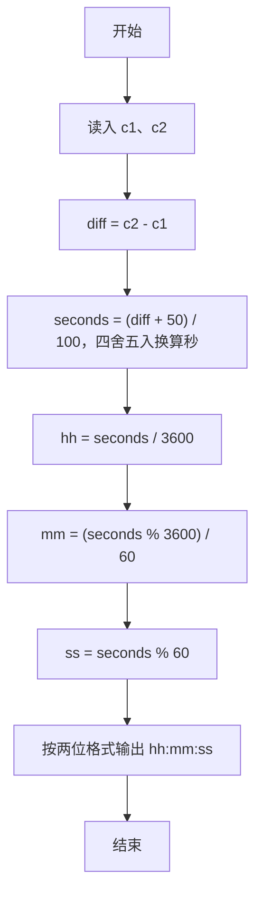
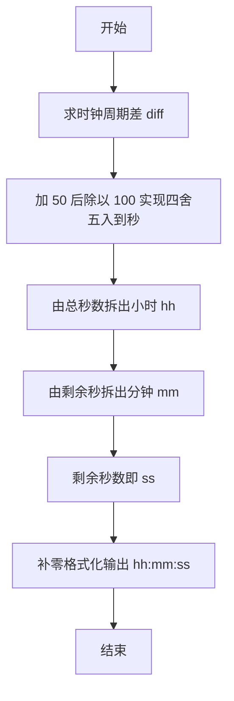

# 1026 程序运行时间 详解

### 解题思路
- 题目给出一段程序的起始和结束时钟读数 c1、c2，时钟以每秒 100 次（CLK_TCK）的频率计数，需换算成 hh:mm:ss 格式的运行时间。
- 先求两次读数之差 diff = c2 - c1，即程序耗用的时钟周期总数。
- 时钟周期数除以 100 得到秒数；由于除法是向下取整，需要实现四舍五入——利用整数技巧 `(diff + 50) / 100`，等价于对除以 100 的结果四舍五入。
- 将总秒数拆分为小时、分钟、秒：hh = seconds / 3600，mm = (seconds % 3600) / 60，ss = seconds % 60。
- 全程使用 int 即可满足数据范围，时间复杂度 O(1)。

### 代码流程说明
- 程序先读取两个整数到变量 c1、c2（起始与结束时钟读数）。
- 计算 diff = c2 - c1 作为时钟周期差，再用 `(diff + 50) / 100` 得到四舍五入后的秒数 seconds。
- 依次计算 hh、mm、ss：先除以 3600 取整得小时，用 `% 3600` 取余后除以 60 得分钟，再对 60 取余得秒。
- 最后用 `printf("%02d:%02d:%02d\n", hh, mm, ss)` 按两位补零格式输出并换行，程序结束。

### 代码流程图

### 解题流程图

