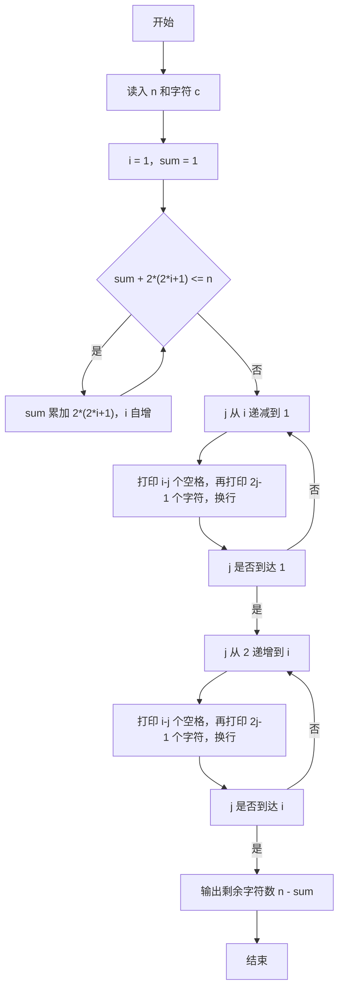
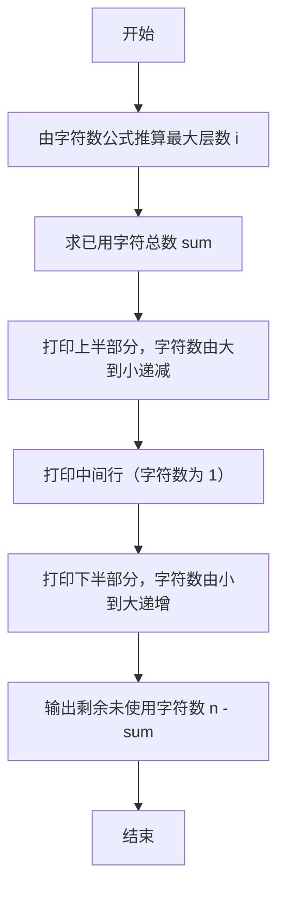

# 1027 打印沙漏 详解

### 解题思路
- 沙漏由对称的两部分构成：从上到下字符数递减，再到中间一行后递增，形成 1、3、5、…、5、3、1 的形状（含中间一行只打印一次）。
- 核心是先求出能用的最大单侧层数 i：沙漏总字符数 = 1 + 2×(3+5+…+(2i-1)) = 2i² - 1。从 i=1、sum=1 开始，若再加一层（上下各新增 2i+1 个字符）后总数仍不超过 n，则累计并继续加层。
- 打印分两部分：上半部分（含中间一行）每层字符数 2j-1 从 2i-1 递减到 1，行首空格数为 i-j；下半部分从 j=2 递增到 i，同样每层 2j-1 个字符、空格数 i-j。
- 最后输出 n - sum，即剩余未使用的字符数。时间复杂度 O(n)，空间 O(1)。

### 代码流程说明
- 程序先用 scanf 读入整数 n 和字符 c。
- 初始化 i = 1、sum = 1，进入 while 循环：只要 `sum + 2*(2*i+1) <= n` 就累加 sum 并让 i 自增，最终 i 为满足总字符数不超过 n 的最大单侧层数。
- 第一个 for 循环从 j = i 递减到 1，每层先打印 i-j 个空格，再打印 2j-1 个字符 c 并换行，输出沙漏上半部分和中间行。
- 第二个 for 循环从 j = 2 递增到 i，同样先打空格再打字符，输出下半部分（不含中间行）。
- 最后打印 `n - sum` 表示剩余字符数，返回 0 结束。

### 代码流程图

### 解题流程图

