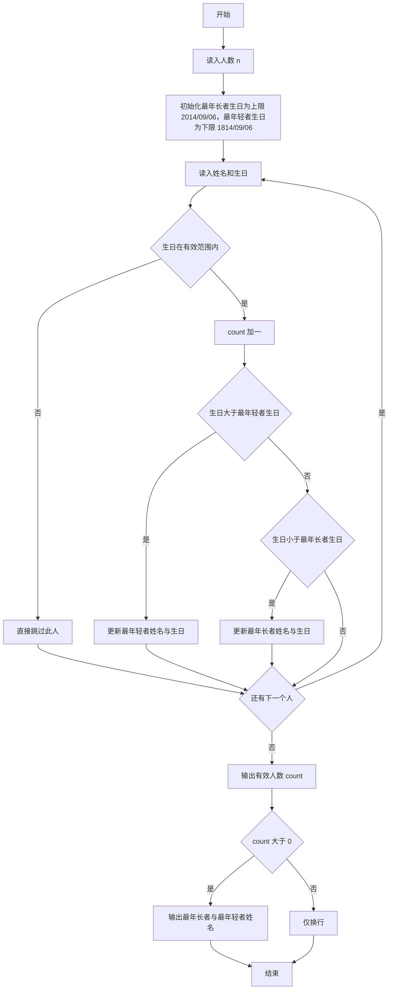
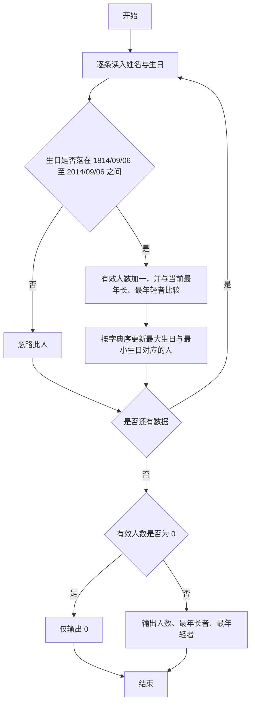

# 1028 人口普查 详解

### 解题思路
- 需要统计生日在 1814/09/06 到 2014/09/06 之间的有效人员，并找出其中最年长（生日最小）和最年轻（生日最大）的人。
- 日期按 YYYY/MM/DD 格式给出，字符串的字典序与时间先后顺序完全一致，因此直接使用 strcmp 比较日期即可，无需拆成数字再比较。
- 维护两个变量：max_birth 存最大的有效生日（对应最年轻者，初始化为范围下限 1814/09/06），min_birth 存最小的有效生日（对应最年长者，初始化为范围上限 2014/09/06），这样每个新读入的有效生日只需与当前值比较。
- 输出时注意：count 为 0 时只输出 0 并换行；否则输出 count、最年长者姓名、最年轻者姓名。时间复杂度 O(n)。

### 代码流程说明
- 程序先读入总人数 n。
- 声明 name、max_name、min_name 三个姓名数组，以及 birthday、max_birth（初始为 "1814/09/06"）、min_birth（初始为 "2014/09/06"）三个日期数组，count 初始为 0。
- 循环 n 次：每次读入姓名和生日，若生日满足 `strcmp(birthday,"1814/09/06") >= 0` 且 `strcmp(birthday,"2014/09/06") <= 0` 则 count 加一；若生日比 max_birth 更大（更年轻）则用 strcpy 更新 max_birth 与 max_name，若比 min_birth 更小（更年长）则更新 min_birth 与 min_name。
- 循环结束后先打印 count；若 count 大于 0，追加输出 min_name（最年长者）和 max_name（最年轻者）并换行，否则单独换行，程序结束。

### 代码流程图

### 解题流程图

