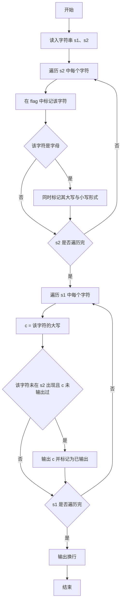
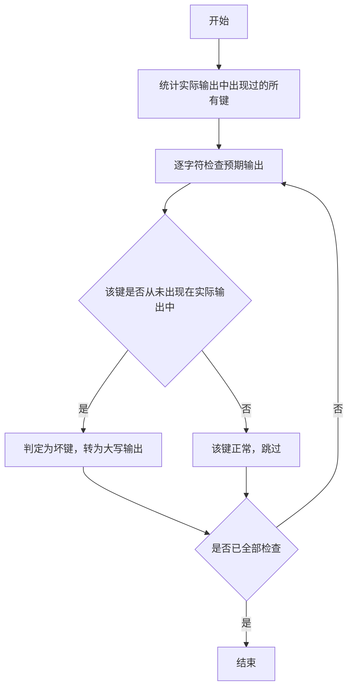

# 1029 旧键盘 详解

### 解题思路
- 题目给出两行字符串：s1 是预期应该输出的文本，s2 是实际输出的文本，需要找出坏掉的键（在 s1 中出现但从未在 s2 中出现）。
- 大小写字母视为同一个键：某个键只要有一个字母出现在 s2 中就说明该键正常，输出坏键时统一用大写。
- 用两个长度为 128 的标记数组（按 ASCII 码作下标）：flag 标记 s2 中出现过的字符（字母同时标记其大写和小写两种形式），output 标记已输出的坏键防止重复。
- 遍历 s1，对每个字符取其大写形式 c，若该字符在 flag 中未标记且大写形式尚未输出过，则判定为坏键并输出。时间复杂度 O(len1 + len2)。

### 代码流程说明
- 程序用 scanf 读入两行字符串 s1、s2，并计算各自长度 len1、len2。
- 遍历 s2 的每个字符：在 flag 中标记该字符；若为字母，则同时标记其 toupper 和 tolower 两种形式，保证大小写视为同一键。
- 遍历 s1 的每个字符：令 c = toupper(s1[i])，若 `!flag[s1[i]]` 且 `!output[c]` 成立，则输出 c 并在 output 中标记，避免重复输出。
- 遍历结束后输出换行，程序结束。

### 代码流程图

### 解题流程图

