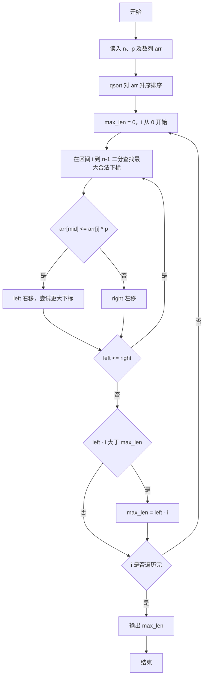
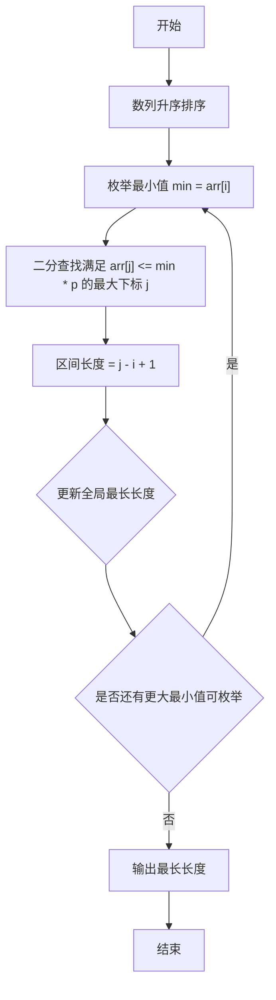

# 1030 完美数列 详解

### 解题思路
- 完美数列要求最大值 max 满足 max <= 最小值 min × p，目标是求满足条件的最长子序列长度。
- 先对数列升序排序（qsort），排序后要找的最长区间一定是连续的一段：固定区间左端（最小值）i，右端越大越容易不满足条件，因此向右找最大的 j 满足 arr[j] <= arr[i] × p。
- 对每个 i 用二分查找定位最大的合法 j，区间长度即 j - i + 1，维护全局最大值 max_len。
- 乘积 arr[i] * p 可能超过 int 范围，因此用 long long 存储数列与 p。整体时间复杂度 O(n log n)。

### 代码流程说明
- 先定义比较函数 cmp，将两个 long long 指针解引用后相减，作为 qsort 的升序比较器。
- main 中读入 n 与 p，用循环读入 n 个数到 long long 数组 arr，再调用 qsort 升序排序。
- 外层 for 循环以每个 i 为区间左端：二分查找区间 [i, n-1] 内最后一个满足 arr[mid] <= arr[i] * p 的位置，left 右移逼近上界；循环结束后区间长度为 left - i，若大于 max_len 则更新。
- 最后打印 max_len 并换行，程序结束。

### 代码流程图

### 解题流程图

