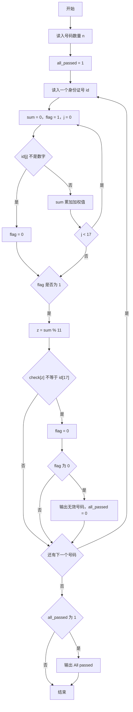
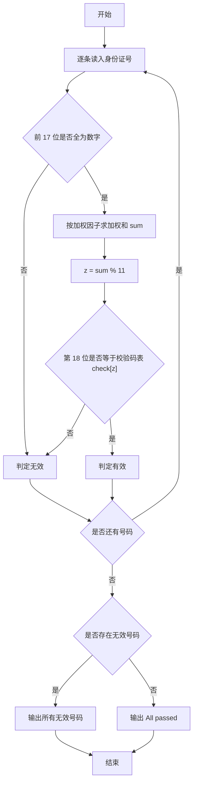

# 1031 查验身份证 详解

### 解题思路
- 身份证校验规则：前 17 位必须是数字，按给定加权因子 weight[0..16] 求加权和，对 11 取模得到 z，第 18 位必须等于校验码表 check[z]（对应 '1','0','X','9','8','7','6','5','4','3','2'）。
- 逐条处理每个身份证号：先检查前 17 位是否全为数字，一旦出现非数字立即标记无效并跳出，避免误做字符运算；前 17 位全数字时才计算加权和并比较校验位。
- 用一个变量 all_passed 记录是否所有号码都有效：只要有一条无效就输出该号码并置 all_passed 为 0；全部有效时最后输出 "All passed"。
- 单条号码处理 O(17)，总时间复杂度 O(17n)，可忽略不计。

### 代码流程说明
- 程序先读入身份证数量 n，定义加权因子数组 weight 与校验码表 check。
- 外层 for 循环逐条读入身份证号 id，内层 for 循环遍历前 17 位：若某位不是数字则 flag 置 0 并 break；否则把 `(id[j]-'0') * weight[j]` 累加到 sum。
- 若 flag 仍为 1，计算 z = sum % 11，比较 check[z] 与 id[17]，不一致则 flag 置 0。
- 若 flag 为 0（无效），printf 输出该号码并令 all_passed = 0。
- 循环结束后若 all_passed 仍为 1，输出 "All passed"，程序结束。

### 代码流程图

### 解题流程图

