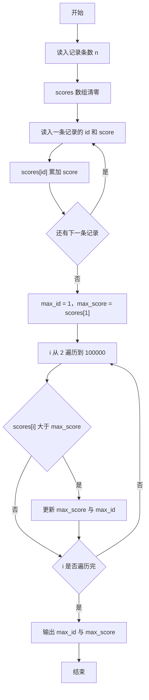
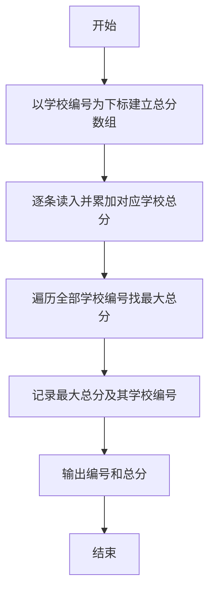

# 1032 挖掘机技术哪家强 详解

### 解题思路
- 需要统计每个学校的总分并找出总分最高的学校，学校编号范围 1~100000。
- 直接用学校编号作为数组下标，开一个大小 100010 的 scores 数组，读入一条记录就把分数累加到对应下标，O(n) 完成统计。
- 遍历所有学校编号求最大总分，同时记录对应编号；遍历从 2 开始到 100000，初值取 1 号学校，避免依赖编号 1 一定存在。
- 题目未规定总分相同时的输出策略，本解法取遍历中第一个出现的最大总分学校。时间复杂度 O(n + 100000)，空间 O(100000)。

### 代码流程说明
- 程序先读入参赛记录条数 n，并把 scores 数组整体初始化为 0。
- for 循环读入 n 条记录：每条包含学校编号 id 与分数 score，执行 scores[id] += score 累加。
- 先令 max_id = 1、max_score = scores[1]，再从 2 到 100000 遍历：若 scores[i] 大于 max_score 则更新 max_score 与 max_id。
- 最后按 `编号 分数` 格式输出 max_id 与 max_score 并换行，程序结束。

### 代码流程图

### 解题流程图

