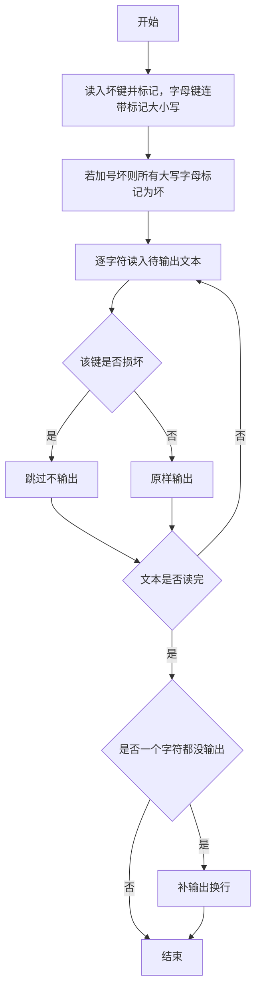

# 1033 旧键盘打字 详解

### 解题思路
- 第一行给出坏掉的键（可能为空行，需逐字符读取处理），第二行是要输出的文本，输出文本中所有未坏的字符。
- 两条特殊规则：大写键坏了则其小写键同样坏（反之亦然，代码中处理大写→小写）；'+' 键坏了则所有大写字母都打不出来。
- 用长度为 128 的 bad 数组按 ASCII 码标记坏键，字母键统一补标大小写，再据 '+' 一次性把所有大写字母标坏。
- 过滤文本时逐字符判断 bad 标记，未坏的原样输出。用 has_output 记录是否输出过任何字符，若全部被过滤则输出一个换行（题目要求）。时间复杂度 O(len)。

### 代码流程说明
- 程序先把 bad 数组清零，用 while 循环配合 getchar 逐个读取第一行的坏键字符，直到遇到换行：每个字符在 bad 中标记；若是大写字母，同时标记对应的小写字母（c + 'a' - 'A'）。第一行为空时循环体一次都不执行。
- 若 bad['+'] 为真，则 for 循环把 'A' 到 'Z' 全部标记为坏。
- has_output 初始为 0，再用 while 循环逐个 getchar 读取第二行文本，直到换行或 EOF：字符未坏则 printf 输出并置 has_output 为 1。
- 若 has_output 为 0，补输出一个换行，程序结束。

### 代码流程图
```mermaid
flowchart TD
    A["开始"] --> B["bad 数组清零"]
    B --> C["用 getchar 逐字符读坏键"]
    C --> D{"读到的字符是换行"}
    D -- "否" --> E["标记该字符为坏键"]
    E --> F{"该字符是大写字母"}
    F -- "是" --> G["同时标记对应小写字母"}
    F -- "否" --> C
    G --> C
    D -- "是" --> H{"加号键是否损坏"}
    H -- "是" --> I["把所有大写字母标记为坏"]
    H -- "否" --> J["has_output = 0"]
    I --> J
    J --> K["用 getchar 逐字符读文本"]
    K --> L{"读到换行或 EOF"}
    L -- "否" --> M{"该字符未坏"}
    M -- "是" --> N["输出该字符，has_output = 1"]
    M -- "否" --> K
    N --> K
    L -- "是" --> O{"has_output 为 0"}
    O -- "是" --> P["输出一个换行"]
    O -- "否" --> Q["结束"]
    P --> Q
```

### 解题流程图

