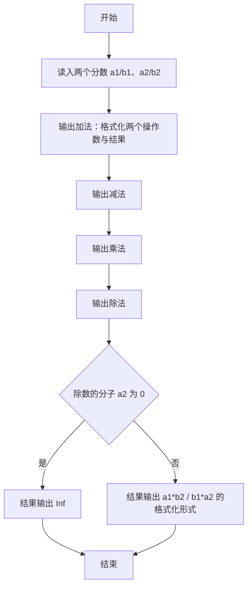
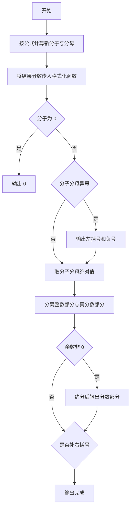

# 1034 有理数四则运算 详解

### 解题思路
- 输入两个分数 a1/b1、a2/b2，输出四种运算的结果，结果要求写成最简真分数带整数部分的形式，负数用括号包裹，除数为 0 输出 Inf。
- 用欧几里得算法 gcd 求最大公约数用于约分；用 long long 存储分子分母，避免乘法溢出。
- print 函数统一负责格式化任意有理数：先特判分子为 0 输出 "0"；判断分子分母异号决定是否加 "(-" 与 ")"；取绝对值后分离整数部分 k 与余数 r；对 r 与分母约分后按有无整数部分决定中间是否加空格。
- 四种运算按公式直接构造新分子分母调用 print：加减乘除分别对应 (ad±bc)/bd、ac/bd、ad/bc，除法额外判断除数 a2 是否为 0。

### 代码流程说明
- 先定义递归函数 gcd：b 为 0 时返回 a，否则递归调用 gcd(b, a % b)。
- print(a, b)：a 为 0 直接输出 "0" 返回；异号时输出 "(-" 并置 flag；取绝对值；k = a/b 为整数部分，r = a%b 为真分数分子；k 非 0 先输出 k；r 非 0 则对 r 与 b 约分，k 非 0 时以 " k/rb" 形式输出、否则以 "r/b" 输出；flag 为真补 ")"。
- main 读入两个分数后依次输出四行：先 print 两个操作数并打印运算符，再 print 结果。加法用 (a1*b2 + a2*b1)/(b1*b2)，减法用 (a1*b2 - a2*b1)/(b1*b2)，乘法用 (a1*a2)/(b1*b2)；除法若 a2 == 0 输出 "Inf"，否则输出 (a1*b2)/(b1*a2)，每行末尾换行。

### 代码流程图

### 解题流程图

