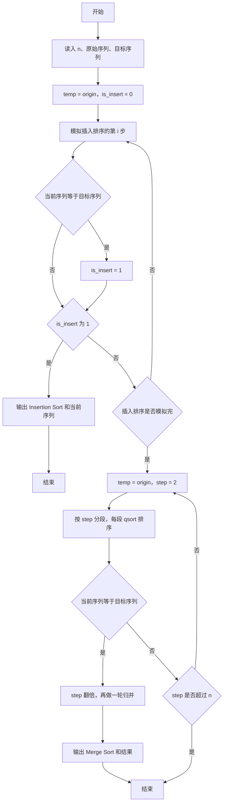
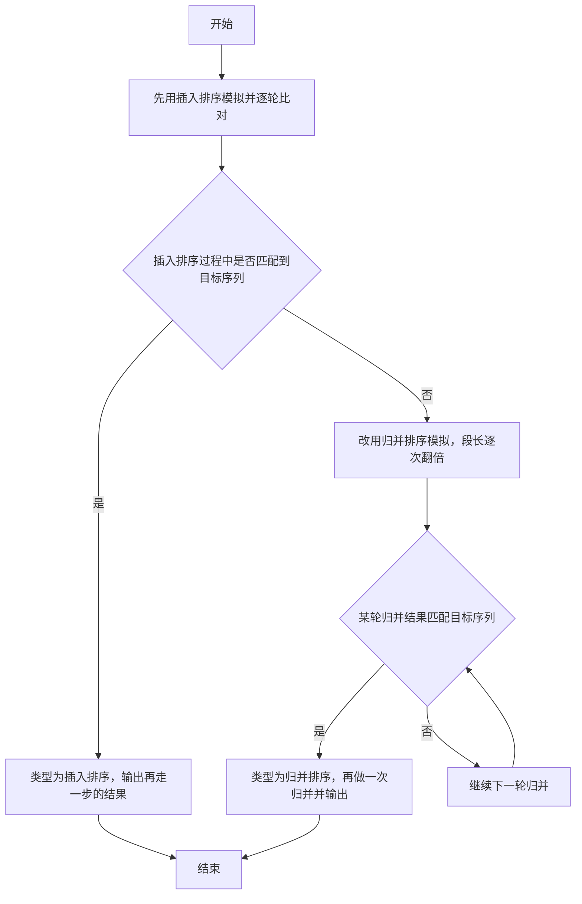

# 1035 插入与归并 详解

### 解题思路
- 给出一段排序中间过程的序列 target，需要判断它属于插入排序还是归并排序，并输出该排序的下一步结果。
- 判断策略是"模拟比对"：先用原始序列模拟插入排序，每一步得到一个中间序列，与 target 比对；一旦发现某一中间序列等于 target，就标记已匹配，下一步产生的序列即为答案。
- 插入排序模拟：从 i=1 到 n-1，把 temp[i] 前移插入到已排序前缀的正确位置。归并排序模拟：段长 step 从 2 开始翻倍，对每个长度为 step 的段用 qsort 排序；若某一步中间序列等于 target，再执行一次归并后输出。
- 注意边界细节：is_insert 标记一旦置 1，后续步骤直接输出；归并时最后一段长度可能不足 step，用 `(i+step <= n) ? step : n-i` 处理。排序与比对均 O(n log n) 级别。

### 代码流程说明
- 定义四个辅助函数：cmp 供 qsort 使用；is_same 逐位比较两数组；copy 将数组 a 复制到 b；print_arr 用空格分隔输出数组（末尾无多余空格）。
- main 读入 n、origin、target，先把 origin 复制到 temp。模拟插入排序：对每个 i 取 val = temp[i]，while 循环把比 val 大的元素后移一位，找到插入位置；插入后若 is_same(temp, target) 则置 is_insert = 1；若 is_insert 已为 1（即上一步匹配过）则输出 "Insertion Sort" 与当前 temp 并返回。
- 插入排序全程未匹配则判定为归并：重新把 origin 复制到 temp，for 循环使 step 从 2 起倍增，内层对每个段 qsort；若 is_same 匹配 target，则把 step 再乘 2 并再做一轮段排序，输出 "Merge Sort" 与结果后返回。

### 代码流程图

### 解题流程图

