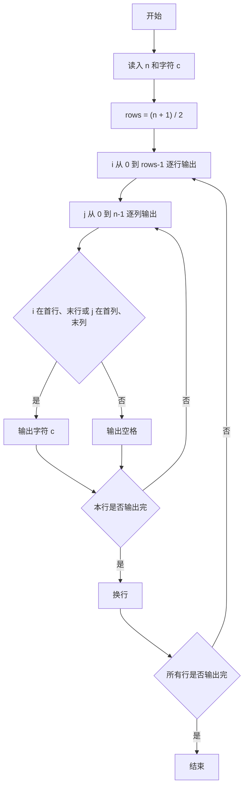
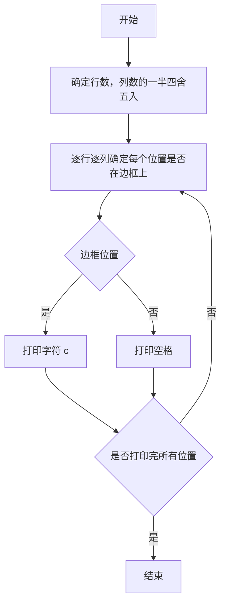

# 1036 跟奥巴马一起编程 详解

### 解题思路
- 要求输出一个由字符 c 构成的空心矩形：行数 rows = (n + 1) / 2（列数的一半四舍五入），每行 n 个字符。
- 矩形规则：第一行、最后一行整行都是字符 c；中间行只有首字符和末字符是 c，其余位置是空格。
- 用双重循环逐行逐列输出：行号 i 满足 i == 0 或 i == rows-1，或列号 j 满足 j == 0 或 j == n-1 时输出 c，否则输出空格。
- 每行末尾换行。时间复杂度 O(rows × n)。

### 代码流程说明
- 程序先用 scanf 读入整数 n 和字符 c。
- 计算行数 rows = (n + 1) / 2（对奇数 n 实现四舍五入）。
- 外层 for 循环控制行 i 从 0 到 rows-1，内层 for 循环控制列 j 从 0 到 n-1：若 `i == 0 || i == rows-1 || j == 0 || j == n-1` 成立则输出字符 c，否则输出空格。
- 内层循环结束后 printf("\n") 换行；所有行输出完毕程序结束。

### 代码流程图

### 解题流程图

