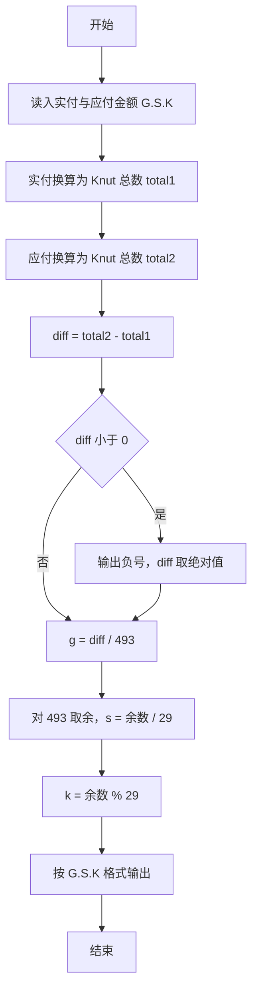
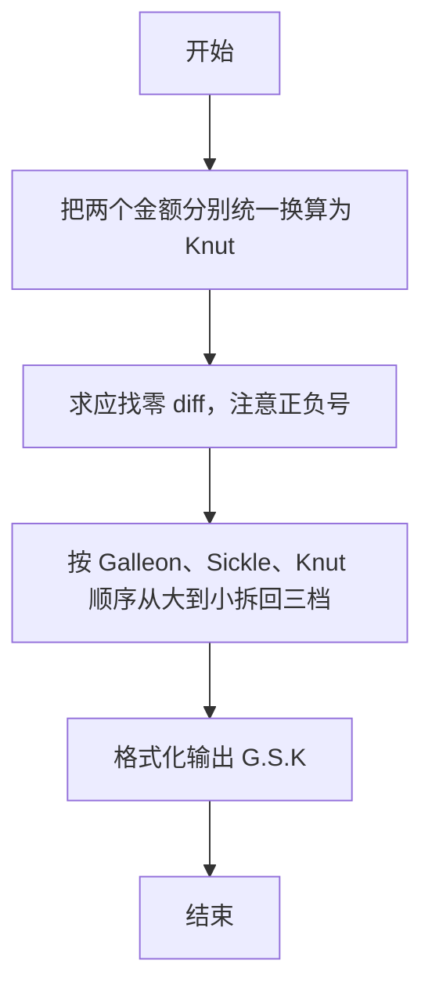

# 1037 在霍格沃茨找零钱 详解

### 解题思路
- 霍格沃茨货币采用 1 Galleon = 17 Sickles、1 Sickle = 29 Knuts 的进制，输入形如 G.S.K。
- 为避免跨单位借位换算的麻烦，先把实付金额和应付金额都统一换算成最小单位 Knut 的总数，再相减得到差额 diff。
- diff 可能为负（实付不足），此时先输出负号再取绝对值，统一用非负整数换算回 Galleon、Sickle、Knut 三档。
- 换算回三档时从大到小整除取余：g = diff / 493，s = (diff % 493) / 29，k = diff % 29。用 long long 防止大金额相乘溢出。时间复杂度 O(1)。

### 代码流程说明
- 程序用 scanf 以 "%d.%d.%d %d.%d.%d" 格式读入实付金额 g1.s1.k1 与应付金额 g2.s2.k2。
- 计算 total1 = g1*17*29 + s1*29 + k1 与 total2 = g2*17*29 + s2*29 + k2，得到两个 Knut 总数，diff = total2 - total1。
- 若 diff 小于 0，先 printf 输出负号，再令 diff = -diff 取绝对值。
- 依次算出 g = diff / 493（493 = 17×29）、diff 对 493 取余后再求 s = diff / 29、k = diff % 29，按 G.S.K 格式输出并换行，程序结束。

### 代码流程图

### 解题流程图

