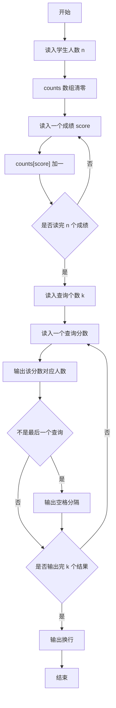
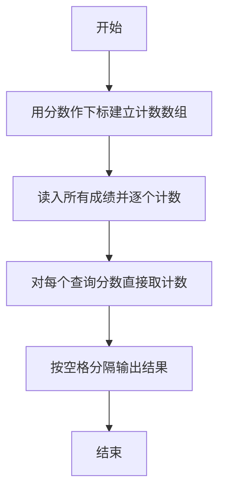

# 1038 统计同成绩学生 详解

### 解题思路
- 分数范围已知为 0~100，直接用分数作为数组下标做桶计数：counts[score] 表示得该分数的学生人数。
- 读入 n 个学生成绩，每个成绩对应下标计数加一，O(n) 完成统计。
- 读入 k 个查询分数，每个查询直接输出 counts[score]，做到 O(1) 查询。
- 输出时注意多个查询结果之间用空格分隔、末尾不能有多余空格，最后补一个换行。总时间复杂度 O(n + k)。

### 代码流程说明
- 程序先读入学生人数 n，counts 数组清零（大小 101 覆盖分数 0~100）。
- for 循环读入 n 个成绩 score，每次执行 counts[score]++。
- 读入查询个数 k，再 for 循环逐个读入查询分数，printf 输出对应的人数 counts[score]；当 i < k-1 时额外输出一个空格分隔。
- 循环结束后输出换行，程序结束。

### 代码流程图

### 解题流程图

