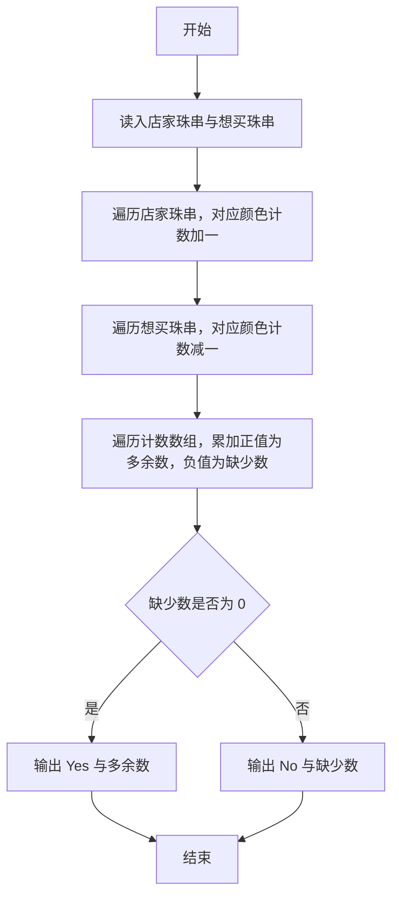
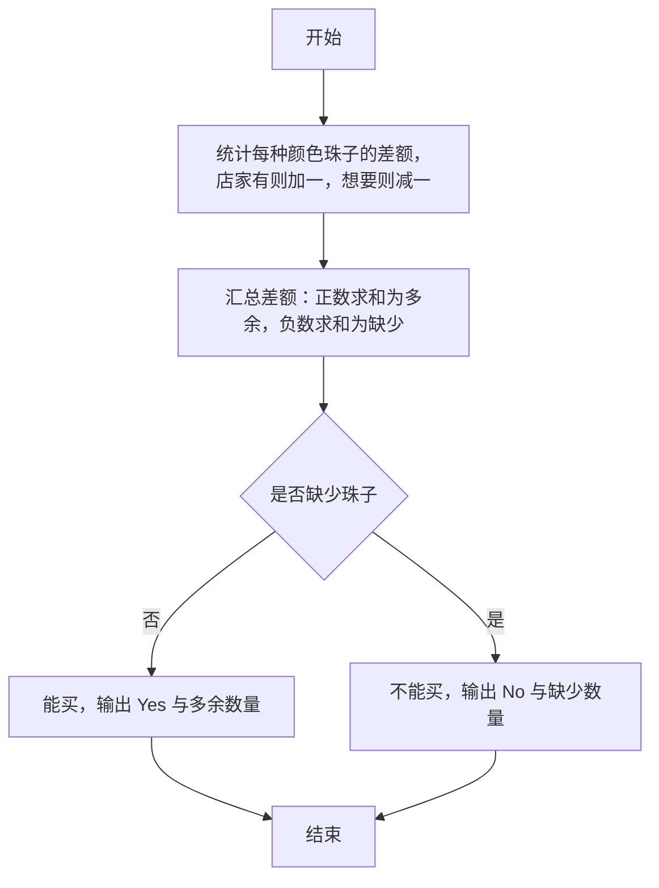

# 1039 到底买不买 详解

### 解题思路
- 店家有一串珠子，顾客想买一串珠子，需要判断店家能否提供全部所需珠子，并统计多余的珠子数或缺少的珠子数。
- 珠子的颜色按 ASCII 码区分，用长度 128 的 cnt 数组统计"差额"：先遍历店家珠串对每个字符 +1，再遍历想买的珠串对每个字符 -1。
- 遍历结束后，cnt[i] > 0 表示店家多出的该色珠子，cnt[i] < 0 表示缺少的该色珠子；分别累加得 extra 与 missing。
- missing 为 0 说明能买，输出 "Yes 多余数"；否则输出 "No 缺少数"。时间复杂度 O(len1 + len2)。

### 代码流程说明
- 程序用 scanf 读入店家的珠串 shop 与想买的珠串 want，cnt 数组清零。
- 第一个 for 循环遍历 shop 的每个字符，cnt[shop[i]] 加一；第二个 for 循环遍历 want 的每个字符，cnt[want[i]] 减一。
- 第三个 for 循环遍历下标 0~127：cnt[i] 大于 0 时把差值累加到 extra，小于 0 时把差值取负累加到 missing。
- 若 missing == 0 输出 "Yes" 加 extra，否则输出 "No" 加 missing，均带换行，程序结束。

### 代码流程图

### 解题流程图

