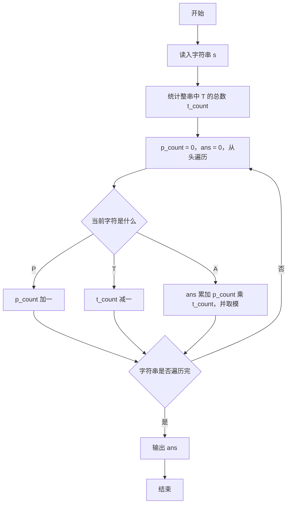
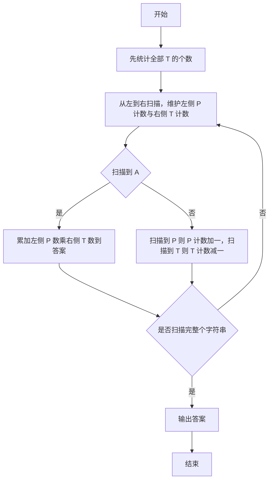

# 1040 有几个PAT 详解

### 解题思路
- 统计字符串中能组成 "PAT" 的三元组个数，要求 P 在 A 前、T 在 A 后，答案对 1000000007 取模。
- 关键观察：以每个 'A' 为中间点，它能组成的 PAT 数 = 它左边 'P' 的个数 × 它右边 'T' 的个数，全部累加即得答案，无需枚举三元组。
- 先扫一遍统计整串 'T' 的总数 t_count；第二次遍历时维护已扫描过的 'P' 数 p_count，遇到 'T' 则 t_count 减一（此 T 已到当前 A 的左边，不能再作为右侧 T）。
- 遇到 'A' 时把 p_count × t_count 累加入答案并取模。用 long long 存答案防止乘法溢出。时间复杂度 O(n)，空间 O(1)。

### 代码流程说明
- 程序读入字符串 s 并计算长度 len。
- 第一次 for 循环统计 s 中 'T' 的总数 t_count。
- 第二次 for 循环从左到右扫描：遇 'P' 则 p_count 加一；遇 'T' 则 t_count 减一（该 T 已位于已扫描区域，之后的 A 不能再与它组成 PAT）；遇 'A' 则执行 ans = (ans + p_count × t_count) % mod。
- 最后输出 ans 并换行，程序结束。

### 代码流程图

### 解题流程图

