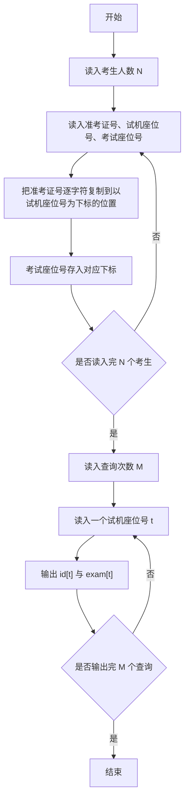
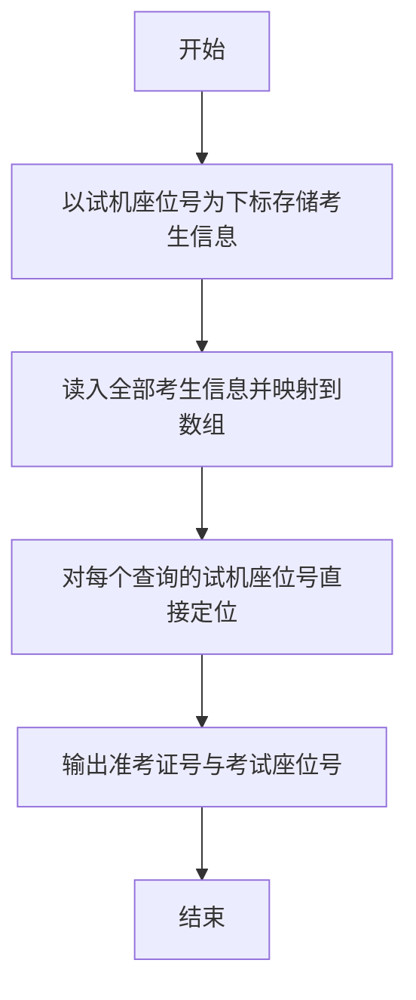

# 1041 考试座位号 详解

### 解题思路
- 考生信息含准考证号、试机座位号、考试座位号，查询按试机座位号进行，因此以试机座位号（范围 1~1000）为数组下标存储数据可实现 O(1) 查询。
- id[test] 存放对应试机座位号的准考证号，exam[test] 存放对应考试座位号。
- 读入时先把信息临时存到数组当前位置，再整体复制到"试机座位号"对应的下标处；因准考证号是字符串，复制需逐字符拷贝并补 '\0'。
- 查询阶段读入 M 个试机座位号，直接输出 id[t] 与 exam[t]。时间复杂度 O(N × 准考证号长度 + M)。

### 代码流程说明
- 程序声明 id[1001][17] 与 exam[1001]，读入考生人数 N。
- for 循环读入每个考生的准考证号、试机座位号 test、考试座位号 exam[i]：先计算准考证号长度 len，再逐字符把 id[i] 复制到 id[test] 并在末尾补 '\0'，最后 exam[test] = exam[i]。
- 读入查询次数 M，for 循环逐个读入试机座位号 t，printf 输出 id[t] 和 exam[t]，换行后程序结束。

### 代码流程图

### 解题流程图

