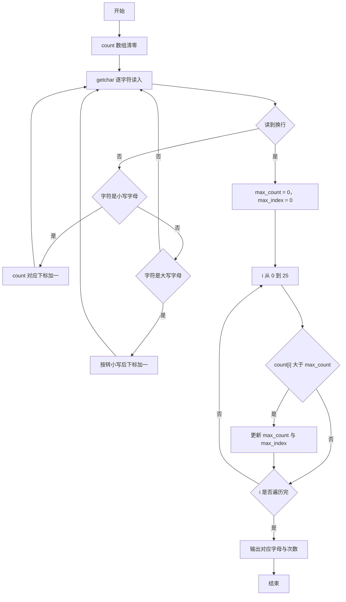
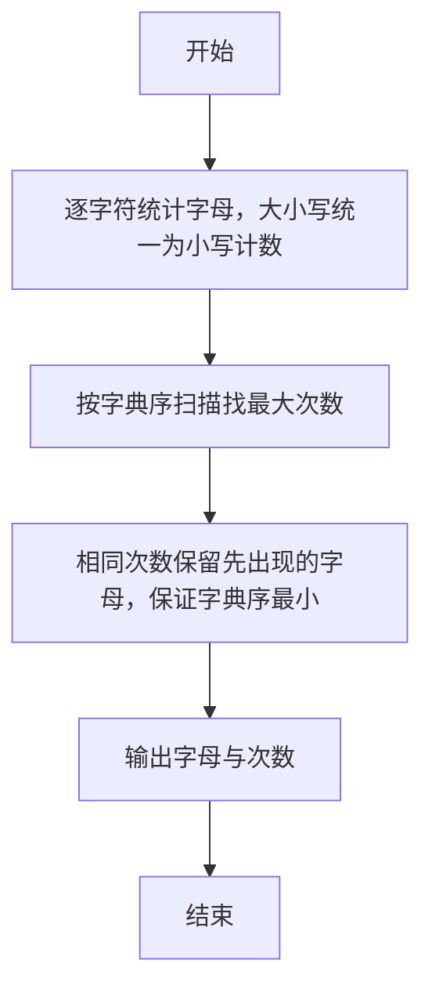

# 1042 字符统计 详解

### 解题思路
- 只需统计英文字母，其他字符忽略；大小写字母算同一个字母，统计时统一转成小写。
- 用长度为 26 的 count 数组按下标 c-'a' 或 c-'A' 计数，逐字符读取输入直到换行。
- 找最大值时从下标 0（字母 a）往后扫描，只在严格大于时更新，遇到并列次数不更新，从而保证输出字典序最小的字母。
- 输出 'a' + max_index 对应的小写字母及其次数。时间复杂度 O(n)，空间 O(1)。

### 代码流程说明
- 程序把 count 数组清零，用 while 循环配合 getchar 逐字符读入直到换行：小写字母执行 count[c-'a']++，大写字母执行 count[c-'A']++，其他字符忽略。
- 令 max_count = 0、max_index = 0，for 循环遍历 26 个下标，仅当 count[i] > max_count 时更新最大值与下标（相等不更新）。
- printf 输出 'a' + max_index 字符和 max_count 数字，换行后程序结束。

### 代码流程图

### 解题流程图

