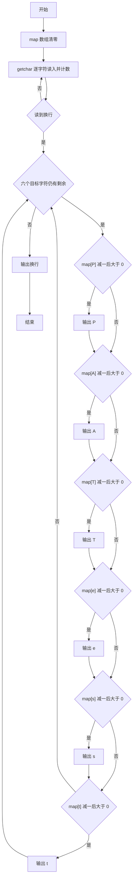
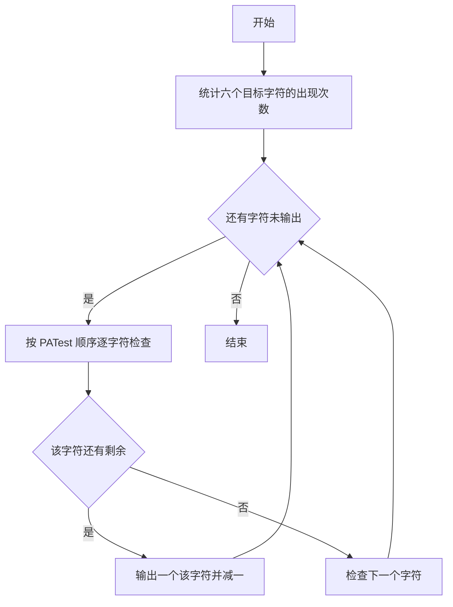

# 1043 输出PATest 详解

### 解题思路
- 输入一串字符，要求按 "PATest" 的固定顺序循环输出其中的 P、A、T、e、s、t 这六个字母，直到这些字母全部输出完，其余字符忽略。
- 用长度 128 的 map 数组按 ASCII 码统计每个字符的出现次数（只需关注六个目标字母）。
- 外层循环条件是六个目标字符中任何一个还有剩余；内层按 P、A、T、e、s、t 顺序依次判断 `map[字符]-- > 0`，有剩余则输出一个字符，利用后置自减同时完成"输出并消耗"。
- 六个字母全部用完时外层循环结束，补一个换行。时间复杂度 O(len + 总输出量)。

### 代码流程说明
- 程序把 map 数组清零，用 while 循环配合 getchar 逐个读入字符直到换行，每读一个就执行 map[c]++。
- 进入 while 外层循环，条件为六个目标字符的剩余总数大于 0；循环体内依次对 'P'、'A'、'T'、'e'、's'、't' 判断 `map[ch]-- > 0`，为真则 printf 输出该字符（后置自减保证剩余量为 0 时不再输出）。
- 外层循环结束后输出换行，程序结束。

### 代码流程图

### 解题流程图

