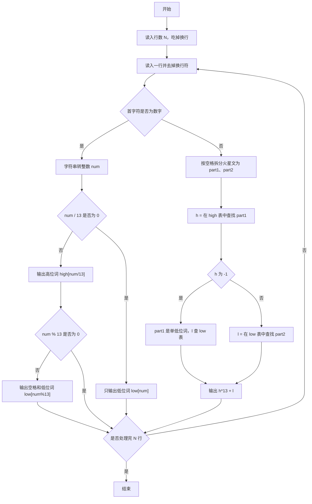
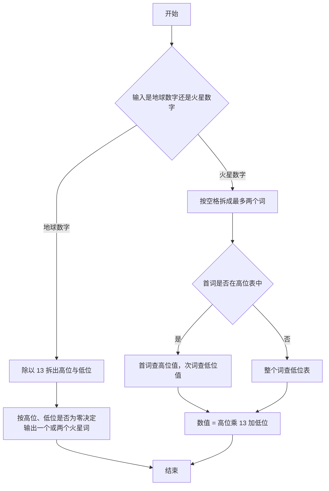

# 1044 火星数字 详解

### 解题思路
- 火星数字是 13 进制：低位表 low[0..12] 对应 0~12，高位表 high[1..12] 对应 13~156（下标 0 置空）。转换时地球数除以 13 取整得高位、取余得低位。
- 输出规则特殊：高位为 0（数字小于 13）只输出低位词；低位为 0 且高位非 0 时只输出高位词，两个词之间用空格分隔。
- 火星转地球时先把输入按空格拆成最多两个词：无空格时可能是一个低位词（如 jan）或一个单独的高位词（如 tam，即 13）；有空格时前词查高位表、后词查低位表。
- 用 find_index 在表中线性查找词返回下标，查不到返回 -1，据此区分"单低位词"与"高位+低位"两种情形。结果 = 高位值 × 13 + 低位值。

### 代码流程说明
- 全局定义低位表 low（含 "tret" 表示 0）与高位表 high（下标 0 为空串），以及查找函数 find_index 遍历比较返回下标。
- main 读入行数 N 后用 getchar 吃掉换行；对每行用 fgets 读入并用 `s[strcspn(s,"\n")]='\0'` 去掉换行符。
- 若首字符是数字，把字符串转成整数 num：num/13 非 0 先输出 high[num/13]，且 num%13 非 0 时再输出空格和 low[num%13]；否则直接输出 low[num]。
- 若首字符非数字，先找空格位置 space_pos：无空格则整个串为 part1；有空格则 strncpy 出 part1（高位）与 part2（低位）。h = find_index(part1, high)，若 h 为 -1 说明单低位词，l 直接查 low；否则 l 查 part2 在 low 中的下标。输出 h*13 + l，换行。

### 代码流程图

### 解题流程图

