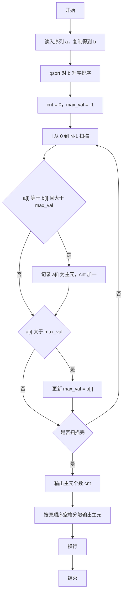
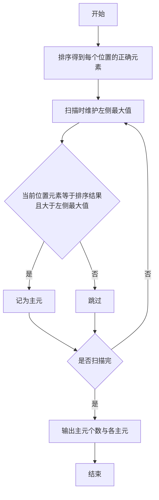

# 1045 快速排序 详解

### 解题思路
- 主元的判定条件有两个：排序后位置不变（a[i] == b[i]，b 为升序排序结果），且大于左侧所有元素。
- 先复制原数组 a 并用 qsort 排序得到 b；排序后位置不变相当于"在排序结果中的正确位置"。
- 从左到右扫描时维护已扫描部分的最大值 max_val：若 a[i] == b[i] 且 a[i] > max_val，则它大于左侧一切元素且位于正确位置，必为主元。
- 注意更新 max_val 要在判定之后进行，且始终取历史最大值。主元按原序列顺序输出，个数为 0 时也要输出空行。时间复杂度 O(n log n)。

### 代码流程说明
- 定义比较函数 cmp 供 qsort 升序使用。
- main 读入 N，循环读入原序列存入 a 并同步复制到 b，然后 qsort 对 b 排序。
- 初始化结果数组 result、计数 cnt 为 0、max_val 为 -1（保证第一个元素只要位置正确即为主元）。
- for 循环扫描：若 `a[i] == b[i] && a[i] > max_val` 则把 a[i] 存入 result 并让 cnt 加一；随后若 a[i] 大于 max_val 则更新 max_val。
- 先输出 cnt 换行，再按 i > 0 时补空格的方式输出所有主元，最后换行，程序结束。

### 代码流程图

### 解题流程图

