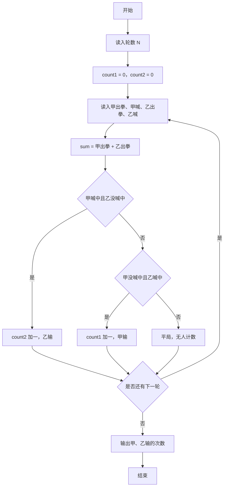
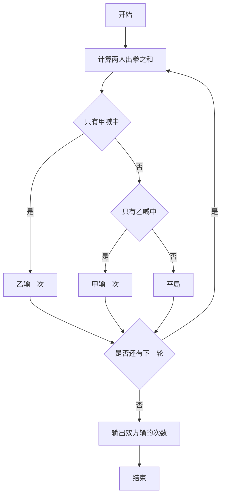

# 1046 划拳 详解

### 解题思路
- 每轮四人输入 a1、a2、b1、b2，分别代表甲出拳、甲喊数、乙出拳、乙喊数；两人出拳之和 sum = a1 + b1。
- 判定规则：只有一方喊的数等于 sum 时该方获胜、另一方喝一杯；都喊中或都没喊中则平局无人喝酒。
- 用 count1 统计甲输（乙赢）的次数、count2 统计乙输（甲赢）的次数，每轮最多只可能有一方计数增加。
- 输出甲、乙各自输的次数。时间复杂度 O(N)。

### 代码流程说明
- 程序读入轮数 N，count1、count2 初始为 0。
- while 循环执行 N 次：scanf 读入 a1、a2、b1、b2，计算 sum = a1 + b1。
- 若 a2 == sum 且 b2 != sum，说明只有甲喊中，乙喝一杯，count2 加一；否则若 a2 != sum 且 b2 == sum，只有乙喊中，甲喝一杯，count1 加一。
- 循环结束后输出 count1 与 count2，空格分隔并换行，程序结束。

### 代码流程图

### 解题流程图

