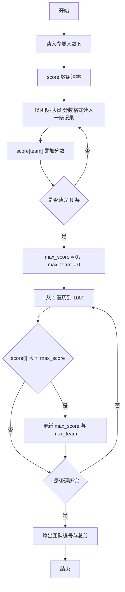
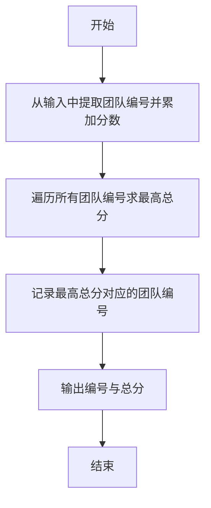

# 1047 编程团体赛 详解

### 解题思路
- 输入格式为"团队编号-队员编号 分数"，需要统计每个团队的总分并输出最高分团队。队员编号对本题无用，可忽略。
- 团队编号范围 1~1000，直接用团队编号作数组下标，开 size 1001 的 score 数组累计总分，O(N) 完成统计。
- 用 scanf 的格式串 "%d-%d %d" 直接解析"团队编号-队员编号 分数"，无需手动拆分字符串。
- 遍历 1~1000 找最大总分，同时记录团队编号。时间复杂度 O(N + 1000)。

### 代码流程说明
- 程序读入参赛人数 N，score 数组清零。
- for 循环读入 N 行：scanf 以 "%d-%d %d" 解析 team、member、s，执行 score[team] += s 累加（member 不参与统计）。
- 令 max_score = 0、max_team = 0，for 循环从 1 到 1000：若 score[i] 大于 max_score 则更新 max_score 与 max_team。
- 输出 max_team 与 max_score，空格分隔换行，程序结束。

### 代码流程图

### 解题流程图

