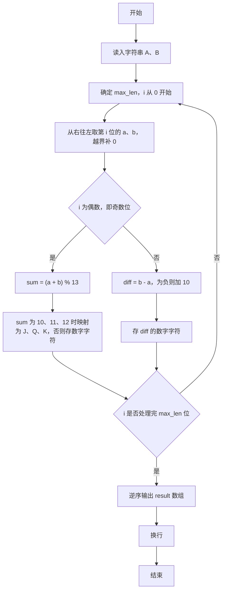
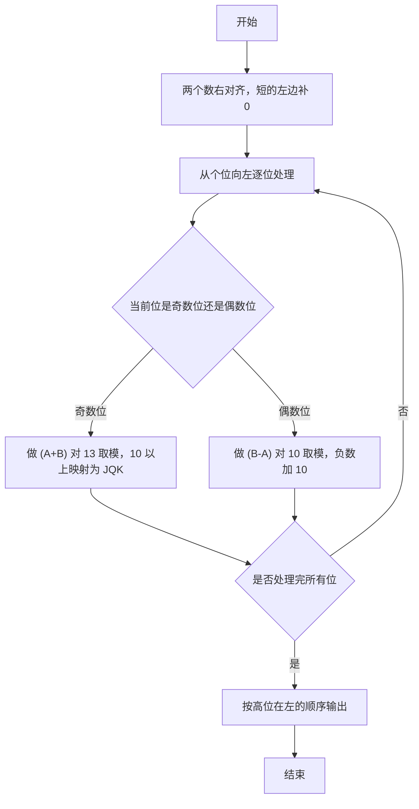

# 1048 数字加密 详解

### 解题思路
- 加密从个位（右侧）开始逐位进行：奇数位（第 1、3、5…位）做 (A+B)%13 并对 10~12 映射为 J、Q、K；偶数位做 (B-A) 对 10 取模，结果为负则加 10。
- 两个数长度可能不同，短的高位视为 0：统一以较长者 max_len 为准，从右往左取位，下标越界即按 0 处理。
- 从右往左处理的结果先逆序存入 result 数组，最后再反转输出，保证加密结果从左到右为高位在前。
- 时间复杂度 O(max_len)，空间 O(max_len)。

### 代码流程说明
- 程序读入字符串 A、B，计算 lenA、lenB 与 max_len。
- for 循环 i 从 0 到 max_len-1 作为从右起的偏移：a = (i < lenA) ? A[lenA-1-i]-'0' : 0，b 同理。
- 若 i 为偶数（对应第 i+1 为奇数位）：sum = (a+b)%13，按 10、11、12 分别存入 'J'、'Q'、'K'，否则存入 sum+'0'；若 i 为奇数（偶数位）：diff = b-a，为负则加 10，存入 diff+'0'。
- 循环结束后 result 中是逆序的加密结果，用 for 循环从 index-1 倒序输出，末尾换行，程序结束。

### 代码流程图

### 解题流程图

