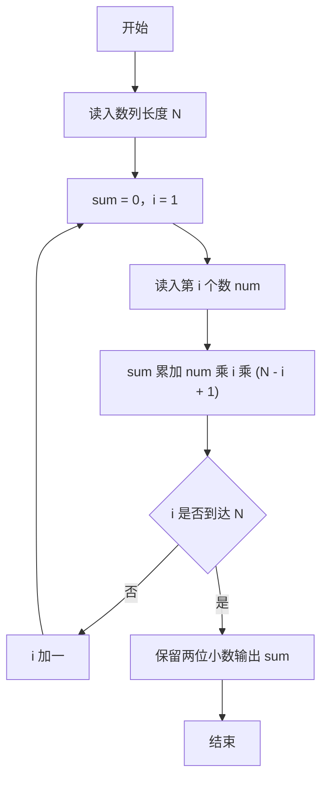
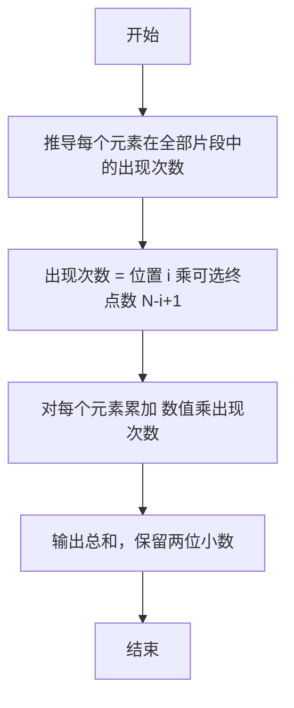

# 1049 数列的片段和 详解

### 解题思路
- 求所有连续子序列（片段）元素和的总和，若枚举所有片段会达到 O(n²)，需用数学方法。
- 关键计数：数列中第 i 个元素（从 1 开始）出现在多少个片段中？片段由起点和终点确定，起点可取 1~i 共 i 种，终点可取 i~N 共 N-i+1 种，因此出现次数 = i × (N-i+1)。
- 总和 = Σ num[i] × i × (N-i+1)，即边读入边累加，无需存储整个数列。
- 用 double 累加，输出保留两位小数。时间复杂度 O(n)，空间 O(1)。

### 代码流程说明
- 程序读入数列长度 N，sum 初始化为 0.0。
- for 循环 i 从 1 到 N：每次 scanf 读入一个数 num，执行 sum += num * i * (N - i + 1)，其中 i 是元素位置、N-i+1 是可选终点数。
- 循环结束后 printf 以 "%.2lf" 输出 sum（保留两位小数）并换行，程序结束。

### 代码流程图

### 解题流程图

